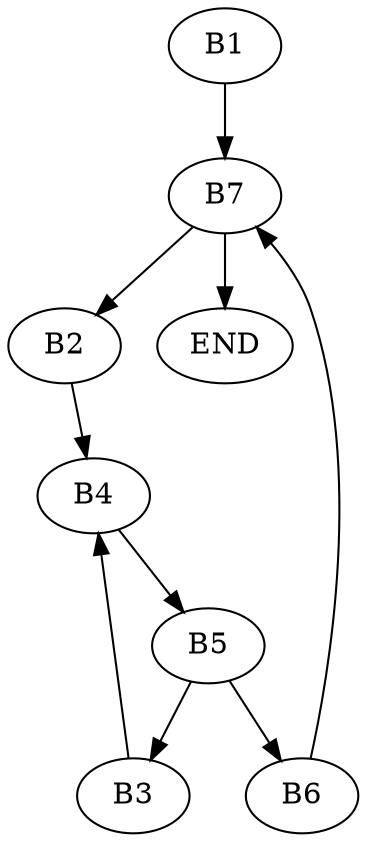

# Architektury systemów komputerowych - reprezentacje liczb, operacje bitowe

## Lista zadań nr 0
### Zadanie 1
* $42_{(8)} = 100010_{(2)} = 34_{(10)} = 22_{(16)}$
* $255_{(8)} = 10101101_{(2)} = 173_{(10)} = AD_{(16)}$
* $3047_{(8)} = 11000100111_{(2)} = 1575_{(10)}= 627_{(16)}$
* $140336_{(8)} = 1100000011011110_{(2)} = 49374_{(10)} = C0DE_{(16)}$

### Zadanie 2
Dodawanie pisemne liczb w systemie szesnastkowym (do zrobienia pisemnie, wtedy wszystko jest jasne).
* $22_{(16)} + 8_{(16)} = 2A_{(16)}$
* $73_{(16)} + 2C_{(16)} = 9F_{(16)}$
* $7F_{(16)} + 7F_{(16)} = FE_{(16)}$
* $C2_{(16)} + A4_{(16)} = 166_{(16)}$

### Zadanie 3
* zerowanie $k$-tego bitu zmiennej $x$: `x = x & ~(1 << k)`
* ustawienie $k$-tego bitu zmiennej $x$: `x = x | (1 << k)`
* negowanie $k$-tego bitu zmiennej $x$: `x = x ^ (1 << k)`

### Zadanie 4
* $x\cdot 2^y$: `x = x << y;`
* $\lfloor \frac{x}{2^y}\rfloor$ = `x = x >> y;`
* $x \mod 2^y$: `x = x & ((1 << y) - 1);`
* $\lceil {\frac{x}{2^y}} \rceil$: `x = (x + (1 << y) - 1) >> y);`

### Zadanie 5
Gaszenie najmniej znaczącego bitu: `x & (x - 1)`.

### Zadanie 6
Konwersja little-endian do big-endian (podana w zadaniu działa w obie strony), dla wytłumaczenia obu pojęć weźmy liczbę $0x12345678$.

**Little-endian**: najmniej znaczący bajt jest w pamięci jako pierwszy, tzn. liczba w pamięci jest przechowywana jako $...|78|56|34|12|...$.

**Big-endian**: najbardziej znaczący bajt jest zapisywany w pamięci jako pierwszy, tzn. liczba w pamięci jest przechowywana jako $...|12|34|56|78|...$.

Konwersja $32$-bitowej zmiennej $x$:
```c= 
x = ((x >> 24) & 0x000000FF) | // przejście z 3. bitu na 0.
    ((x << 8)  & 0x00FF0000) | // 1 -> 2
    ((x >> 8)  & 0x0000FF00) | // 2 -> 1
    ((x << 24) & 0xFF000000);  // 0 -> 3
```

### Zadanie 7, 8
Do ogarnięcia na wikipedii, jedno to opis ASCII i kilku znaków sterujących, inne to opis zapisu UTF-8.

## Lista zadań nr 1

### Zadanie 1
Kopiowanie $i$-tego bitu na $k$-tą pozycję w zmiennej $x$:
```c= 
int i, k, x;
// uzyskujemy najpierw i-ty oraz k-ty bit ze zmiennych
int bit_i = (x >> i) & 1;
int bit_k = (x >> k) & 1;
// sprawdzamy czy wybrany bit należy zanegować
int w = bit_i ^ bit_k;
// przesuwamy bit na odpowiednie miejsce i zamieniamy (jesli trzeba)
w = w << k;
x = x ^ w;
```

Można też to zrobić inaczej, znacznie krótszym sposobem:
```c 
((x >> i) & 1) << k | x & ~(1 << k);
```

### Zadanie 2
Obliczanie liczby zapalonych bitów w czasie $O(\log_2 n)$. Metodą, którą należy się posłużyć, jest dziel i zwyciężaj. W tym przypadku będzie ona działać na zasadzie podziału liczby najpierw na $32$ osobne bity, a następnie w każdej iteracji, na sumowaniu zapalonych bitów (na początku w każdej dwójce, później czwórce, ósemce, szesnastce): otrzymany wynik w systemie binarnym będzie liczbą zapalonych bitów.

```c= 
x = (x & 0x55555555) + ((x >> 1)  & 0x55555555);
x = (x & 0x33333333) + ((x >> 2)  & 0x33333333);
x = (x & 0x0F0F0F0F) + ((x >> 4)  & 0x0F0F0F0F);
x = (x & 0x00FF00FF) + ((x >> 8)  & 0x00FF00FF);
x = (x & 0x0000FFFF) + ((x >> 16) & 0x0000FFFF);
```
Masek używamy do uzyskania odpowiednich bitów w każdej kolejnej "iteracji" algorytmu, a dzięki przesunięciom bitowym możemy łatwo sumować liczby w kolejnych krokach.

### Zadanie 3
Mamy za zadanie przerobić struktury tak, aby zajmowały mniej miejsca w pamięci. Zakładamy, że mamy do czynienia z systemem $32$-bitowym, a więc wskaźnik ma rozmiar $4$ bajtów.
```c=
struct A {
    int8_t  a;
    void   *b;
    int8_t  c;
    int16_t d;
};
```
Ta struktura w pamięci zajmuje $12$ bajtów: `a` jest przechowywane w pierwszym bajcie, jednak kolejne $3$ są puste, jako że `void*` musi mieć adres $\mod 4$, aby łatwo było się do niego dostać. Później mamy $1$ bajt przeznaczony na `c`, jeden bajt przerwy oraz dwa na `d`. W pamięci jest to reprezentowane jako: `a---bbbb----c-dd` (myślnik oznacza pustą pamięć). Aby zoptymalizować tę strukturę, należałoby ułożyć dane w kolejności malejącej pod względem zajmowanej pamięci, tzn. `b, d, a, c`. Wtedy struktura `A` będzie zajmować tylko $8$ bajtów.
```c=
struct B {
    uint16_t a;
    double   b;
    void    *c;
};
```
W tej sytuacji `double` zajmuje aż $8$ bajtów, a więc każdą zmienną dopełniamy do $\mod 8$. Z tego powodu `B` zajmuje $24$ bajty, a w pamięci jest reprezentowana jako: `aa------bbbbbbbbcccc----`. Możemy posortować zmienne w strukturze, aby uzyskać `b, c, a` - wtedy struktura będzie zajmować $16$ bajtów.

### Zadanie 4
Do znalezienia na necie, ale w skrócie:  
**volatile** - zmienna może być zmieniona spoza programu, a jej wartość jest odczytywana za każdym razem z pamięci, a nie z rejestru.
**static** - zmienna mająca tylko jedną instancję w bloku programu, istnieje przez cały czas jego działania. Zmienna statyczna zadeklarowana w bloku funkcji pamięta swoją wartość po wyjściu z funkcji pomiędzy wywołaniami. Globalna zmienna statyczna lub funkcja jest widoczna tylko w jednym pliku, dzięki czemu można je ukryć przed innymi zmiennymi globalnymi nazwanymi tak samo.
**restrict** - zasygnalizowanie kompilatorowi, że dany wskaźnik nie duplikuje się z żadnym innym, jeżeli osoba pisząca kod o tym zapomni, to program się wysypie.

### Zadanie 5
Przerobienie instrukcji na kod trójkowy (każda instrukcja to inna linijka):
* `s += b[j + 1] + b[--j]`: 
```c=
t1 = j + 1; t1 = t1 * 4; t2 = b + t1; l = *t2; // l = b[j+1]
j  = j - 1; t3 = 4 * j;  t4 = b + t3; r = *t4; // r = b[--j]
t5 = l + r; s  = s + t5;                       // s += l + r
```
* `a[i++] -= *b * (c[j * 2] + 1)`:
```c= 
t1 = j * 2;  t1 = t1 * 4; t2 = c + t1; c = *t2; // c[j * 2]
t3 = t3 * 4; t4 = a + t3; a = *t4;
a_temp = a;  t5 = c + 1;  t6 = b * t5; t7 = a_temp - t6; a = *t7; i = i + 1;
```

### Zadanie 6
Używamy `struct A *us, *vs` z zadania 3, musimy przepisać instrukcję  
`vs->d = us[1].a + us[j].c;`:
```c= 
t1 = us + 12;
t2 = *t1;
t3 = j * 12;
t4 = t3 + us;
t5 = t4 + 8;
t6 = *t5;
t7 = vs + 10;
t8 = t2 + t6;
*t7 = t8;
```

### Zadanie 7
Kolejne przepisywanie do kodu trójkowego + graf przepływu sterowania.



### Zadanie 8
Mamy funkcję `secret`, działa ona jak $8$-bajtowy `memcpy`, można ją przepisać w następujący sposób:
```c= 
void secret(uint8_t *to, uint8_t *from, size_t count)
{
    size_t n = (count + 7) / 8;
    static void *label_array[] = {&&l0, &&l1, &&l2, ..., &&l7};
    goto *label_array[count % 8];
    
    l0:    *to++ = *from++;
    l7:    *to++ = *from++;
    l6:    *to++ = *from++;
    ...
    l1:    *to++ = *from++;
    
    if (--n > 0) 
        goto l0;
}
```

## Lista zadań nr 2
### Zadanie 1
Czy wyrażenia zawsze wyliczają się do prawdy dla `x, y` będących typu `int32_t`? 
*    `(x > 0) || (x - 1 < 0)`
    Weźmy $x = 100...00_{(2)} = -2147483648 = \text{INT_MIN}$, czyli najmniejszą możliwą wartość dla `int32_t`. Wtedy `x > 0` jest fałszem. Obliczmy drugie wyrażenie z alternatywy: 
    $x-1 = 100...00_{(2)}-1 = 0111...11_{(2)} = 2147483647 = \text{INT_MAX}$. Otrzymujemy również fałsz dla `x - 1 < 0`, czyli wyrażenie nie zawsze oblicza się do prawdy.

*    `(x & 7) != 7 || (x << 29 < 0)`
    Zwracana wartość wyrażenia `(x & 7) != 7` będzie prawdą, jeżeli chociaż jeden z trzech najmniej znaczących bitów `x` będzie zgaszony. Weźmy więc $x=b_{31}b_{30}\dots b_{3}111_{(2)}$ (dający fałsz w lewym podwyrażeniu), a następnie przesuńmy o $29$ bitów w lewo - otrzymana liczba ma wartość $11100\dots 000_{(2)}$, a więc jest ujemna, czyli wyrażenie zawsze zwróci prawdę.
    
*    `(x * x) >= 0`
    Weźmy $x=2^{16}+2^{14}$. Wtedy $x^2 = 2^{32}+2\cdot2^{30}+2^{28}=2^{32}+2^{31}+2^{28}$. Chcąc zapisać tą wartość z wykorzystaniem przesunięć bitowych, mielibyśmy `x = (1 << 32) + (1 << 31) + (1 << 28)`, co dałoby nam liczbę ujemną, jako że `(1 << 32) = 0`, `(1 << 31) = INT_MIN`, a `abs(INT_MIN) > abs(1 << 28)`. To oznacza, że wyrażenie nie zawsze obliczy się do prawdy.
    
*    `x < 0 || -x <= 0`
    To wyrażenie zawsze obliczy się do prawdy, jako że liczb ujemnych w `int32_t` jest o jedną więcej od dodatnich.
    
*    `x > 0 || -x >= 0`
    Fałsz dla $x = \text{INT_MIN}$. Lewa strona oczywista, rozpiszmy jednak prawą. Obliczmy 
    $$-x = -\text{INT_MIN} = -(-2147483648) = 2147483648 \\= \text{INT_MAX} + 1 = 011...111 + 1 = 10...000 = \text{INT_MIN}$$
    Otrzymujemy więc w całym wyrażeniu fałsz.
    
*    `(x | -x) >> 31 == -1`
    Fałsz dla $x=0$. `(x | -x)` obliczy się do zera, przesunięcie arytmetyczne w prawo sprawi, że uzyskamy liczbę $00...000$, która nie jest z pewnością równa $-1$.
    
*    `x + y == (uint32_t)y + (uint32_t)x`
    Rzutowanie zmiennych do `unsigned` jest "zaraźliwe", tzn. całe wyrażenie jest rzutowane do `unsigned`, przez co otrzymujemy `(uint32_t)(x + y) == (uint32_t)y + (uint32_t)x`. Otrzymana wartość jest zawsze prawdziwa.
    
*    `x * ~y + (uint32_t)y * (uint32_t)x == -x`
    Skorzystamy z własności `~x + 1 == -x`, obserwacji `~x + x == -1` oraz "zaraźliwości" `unsigned`. Dzięki temu musimy udowodnić własność 
    `(uint32_t)x * (uint32_t)(~y) + (uint32_t)y * (uint32_t)x == (uint32_t)(-x)`. Wyciągnijmy więc `(uint32_t)x` przed nawias, dzięki czemu uzyskamy 
    `(uint32_t)(~y) + (uint32_t)y = UINT32T_MAX`, a pomnożenie `(uint32_t)x * UINT32T_MAX` zwróci nam wartość `UINT32T_MAX - (uint32_t)x`, co jest równe wartości `(uint32_t)(-x)`.
    
    
### Zadanie 2
Zmiana wartości zmiennych `x, y` w miejscu (tzn. bez pomocniczych zmiennych).

W tym celu użyjemy kilka razy operacji XOR do zamiany adresów przechowywanych zmiennych typu `T`.
```c=
void inplace_swap(T *x, T *y)
{
    if (x != y) // dla x == y byłoby x^y = 0
    {
        *y = *y ^ *x;
        *x = *x ^ *y;
        *y = *y ^ *x;
    }
}
```
Co do samego algorytmu, to jest on wolny i raczej nigdzie nie jest aktualnie stosowany, chyba że w systemach wbudowanych, gdzie pamięć jest mocno ograniczona. Działa on w taki sposób jak przedstawiono poniżej (zakładając, że `x != y`, gdyż wtedy `x XOR y = 0`).

|   Krok   |        `*x`         |        `*y`         |
|:--------:|:-------------------:|:-------------------:|
| Początek |         `a`         |         `b`         |
| Krok 1.  |         `a`         |        `a^b`        |
| Krok 2.  | `a^(a^b)=(a^a)^b=b` |        `a^b`        |
| Krok 3.  |         `b`         | `b^(a^b)=(b^b)^a=a` |

### Zadanie 3
**Nadmiar** (ang. overflow) - przekroczenie zakresu wartości, które może przyjąć zmienna, np. dla `int32_t` będzie to wyjście poza `INT_MAX`, co sprawi, że uzyskany wynik będzie ujemny.

**Niedomiar** (ang. underflow) - wartość, na której działamy jest tak mała, że wzięta z niej wartość bezwzględna jest mniejsza niż najmniejsza liczba większa od zera możliwa do zapisania w tej zmiennej. Dla `int` nie ma możliwości wystąpenia niedomiaru.

Sprawdzenie, czy występuje positive overflow lub negative overflow jest sensowne w przypadku, gdy $x,y$ są tego samego znaku:   
*    Dla $x,y>0$ poniższa funkcja zwróci $1$, gdy wystąpi nadmiar (positive overflow), ponieważ najbardziej znaczący bit zmieni się na $1$, co sprawi, że w reprezentacji uzupełnień do dwóch zmienna $s$ stanie się liczbą ujemną.  
*    W przypadku $x,y<0$ suma $s$ przy negative overflow będzie miała $0$ na najbardziej znaczącym bicie. Najłatwiej to pokazać na przykładzie $4$-bitowych liczb (wtedy przesunięcie bitowe w funkcji jest tylko o $3$ bity), np. $(-8)+(-7) = 1000_{(2)} + 1001_{(2)} = 10001_{(2)}$. Najbardziej znaczący bit zostanie w tej reprezentacji odrzucony, co sprawi, że wynikiem działania będzie $0001_{(2)} = 1$. Wartość `does_overflow` będzie równa $1$, gdy wystąpi negative overflow.
```c
does_overflow = (((x + y) ^ x) & ((x + y) ^ y)) >> 31;
```

### Zadanie 4
Do zjawiska przeniesienia lub pożyczki może dojść, gdy pracujemy na wartościach wielobajtowych i w celu przyspieszenia operacji dodajemy lub odejmujemy kilka słów na raz.

Do przeniesienia dochodzi, gdy po dodaniu dwie liczby nie mieszczą się w przeznaczonym im zakresie pamięci (np. bajcie), wtedy jeden z bitów przenosi (propaguje) się do bajtu obok (bardziej znaczącego).

Zjawisko pożyczki jest analogiczne, z tym że występuje ono przy odejmowaniu, z bardziej znaczącego bajtu zostaje wtedy pożyczona wartość.

```c=
uint32_t sum = (x & 0x7F7F7F7F) + (y & 0x7F7F7F7F);
sum ^= ((x ^ y) & 0x80808080);
    
uint32_t diff = (x | 0x80808080) - (y & 0x7F7F7F7F);
diff ^= 0x80808080 ^ ((x ^ y) & 0x80808080);
```

Wartość sum obliczana jest tak, że najpierw dodajemy odpowiednie słowo bez ich najbardziej znaczącego bitu, następnie ustalamy jego parzystość.

Analogicznie odejmowanie, najpierw zapewniamy sobie, że zapobiegniamy zjawisku pożyczki, obliczamy poprawny wynik dla 7 bitów słowa, a następnie ustalamy parzystość najbardziej znaczącego bitu.

### Zadanie 5
Obliczanie `x * 3 / 4` zaokrąglając w dół - nie możemy używać rzutowania, więc w jakiś sposób musimy zapamiętać bity przy potencjalnym nadmiarze (jako że najpierw mnożymy przez 3, możemy wyjść poza zakres) - odpowiadają za to dwie pierwsze linijki funkcji.

```c=
int32_t threefourths(int32_t x)
{
    int32_t temp_x = (x >> 1) + (x >> 2);
    int32_t overflow_bits = 0xC0000000 & temp_x;
    
    int32_t temp = x;
    temp <<= 1; // x * 2
    temp +=  x; // x * 2 + x
    temp >>= 2; // (x * 2 + x) / 4
    
    temp ^= overflow_bits;
    return temp;
}
```

### Zadanie 6
Porównanie wartości `x < y` dla liczb bez znaku `uint32_t` i ze znakiem `int32_t` wygląda dokładnie tak samo. Funkcja `lessthan` sprawdza najpierw wartość $\frac{x}{2} - \frac{y}{2}$, dzięki czemu mamy pewność, że nie dojdzie do przepełnienia, a następnie odejmujemy $1$, w razie gdyby w wyniku przesunięć zostały utracone ważne informacje.

```c= 
bool lessthan(T x, T y) // dla T == (uint32_t || int32_t)
{
    return ((x >> 1) - (y >> 1) - (~x & y & 1));
}
```

### Zadanie 7
Obliczenie funkcji `abs(x)`, tj. wartości bezwględnej.  

Wartość `mask` to $111...111_{(2)} = -1$ lub $000...000_{(2)} = 0$ (własność przesunięcia arytmetycznego). Rozpatrzmy dwa przypadki:
*    $x \geq 0$: Wartość `mask` będzie równa 0, więc stosując obliczając `(mask + x) ^ mask` otrzymamy tak naprawdę `x + 0`, czyli `x`.
*    $x < 0$: `x` na najbardziej znaczącym bicie ma wartość $1$, a więc maska ma wartość równą $111...111_{(2)} = -1$. Dodając `mask + x` otrzymamy wartość, która po użyciu XOR z `mask` będzie wartością bezwzględną `x`.  
Przykład: $x = 10110011_{(2)} = -77$, wtedy $\text{mask} = 11111111_{(2)}$. Po dodaniu obu liczb otrzymamy $110110010_{(2)}$, jednak najbardziej znaczący bit musimy uciąć, więc pozostaje nam liczba $10110010_{(2)}$. Wartość tą XORujemy z `mask`, dzięki czemu otrzymujemy wartość $01001101_{(2)} = 77$.
```c= 
int32_t abs(int32_t x)
{
    int32_t mask = x >> 31; // dla N-bitowej liczby przesuwamy o (N-1)
    return (mask + x) ^ mask;
}
```

### Zadanie 8
Obliczanie funkcji `sign(x)`, tj. znaku stojącego przy `x`, zwraca ona jedną z wartości $-1, 0, 1$. Poniższe rozwiązanie funkcji `sign` nie działa dla `x == INT_MIN`, dla `sign2` jest wszystko w porządku.

```c= 
int32_t sign(int32_t x)
{
    return (x >> 31) - (-x >> 31);
}
```

```c= 
int32_t sign2(int32_t x)
{
    return x >> (N-1) | -x >> (N-1) & 1;
}
```

Powyższa funkcja ustawia dwie maski dla liczby `x` będące $111...111_{(2)} = -1$ lub $000...000_{(2)} = 0$. Dzięki temu odejmując je od siebie w odpowiedni sposób, uzyskamy jedną z oczekiwanych wartości w zależności od znaku liczby. Na poniższym przykładzie dla liczby $4$-bitowej możemy prześledzić działanie funkcji `sign`.


| `x`               | `x >> 31`         | `-x >> 31`        | `(x >> 31) - (-x >> 31)` |
| :---------------: | :---------------: | :---------------: | :----------------------: |
| $3 = 0011_{(2)}$  | $0000_{(2)} = 0$  | $1111_{(2)} = -1$ | $0 - (-1) = 1$           |
| $0 = 0000_{(2)}$  | $0000_{(2)} = 0$  | $0000_{(2)} = 0$  | $0 - 0 = 0$              |
| $-3 = 1101_{(2)}$ | $1111_{(2)} = -1$ | $0000_{(2)} = 0$  | $-1 - 0 = -1$            |

### Zadanie 9
Funkcja stwierdzająca czy `x` ma nieparzystą liczbę jedynek w zapisie binarnym. Do rozwiązania wykorzystamy wiedzę z poprzedniej listy zadań, tzn. z algorytmu na obliczenie jedynek w zapisie binarnym, a następnie sprawdzimy czy ostatni bit jest zapalony czy nie.

```c= 
int32_t odd_ones(uint32_t x)
{
    x = (x & 0x55555555) + ((x >> 1) & 0x55555555);
    x = (x & 0x33333333) + ((x >> 2) & 0x33333333);
    x = (x & 0x0F0F0F0F) + ((x >> 4) & 0x0F0F0F0F);
    x = (x & 0x00FF00FF) + ((x >> 8) & 0x00FF00FF);
    x = (x & 0x0000FFFF) + ((x >> 16) & 0x0000FFFF);
    
    return (x & 1);
}
```

```c=
int32_t odd_ones(uint32_t x)
{
    x ^= x >> 1;
    x ^= x >> 2;
    x ^= x >> 4;
    x ^= x >> 8;
    x ^= x >> 16;
    return x & 1;
}
```

## Lista zadań nr 3

### Zadanie 1
```c=
int32_t div3(int32_t n){
    const int64_t M = ((1ll << 32) + 2) / 3;
    return (n * M >> 32) + (n < 0);
}
```
Dla dodatnich:
$\lfloor \frac{2^{32}+2}{3} \frac{n}{2^{32}} \rfloor = \lfloor \frac{n}{3} + \frac{2n}{3\cdot2^{32}} \rfloor = \lfloor \frac{n}{3} \rfloor$
Dla $0 \leq n < 2^{31}$ zachodzi $0 < \frac{2n}{3\cdot2^{32}} < \frac{1}{3}$.

Dla ujemnych:
$\lfloor \frac{2^{32}+2}{3} \frac{n}{2^{32}} \rfloor + 1 = \lfloor \frac{2^{32}n+2n+3\cdot2^{32}}{3\cdot2^{32}}\rfloor = \lceil \frac{2^{32}n+2n+1}{3\cdot2^{32}} \rceil = \lceil \frac{n}{3} + \frac{2n+1}{3\cdot2^{32}} \rceil = \lceil \frac{n}{3} \rceil$
Dla $-2^{31} \leq n \leq -1$ zachodzi $-\frac{1}{3} < \frac{2n+1}{3\cdot2^{32}} < 0$.

### Zadanie 2
W standardzie *IEEE 754-2008* liczby 16-bitowe typu `float` są zapisywane jako 
$$\underbrace{s}_{\text{znak}}\underbrace{eeeee}_{\text{wykładnik}}\underbrace{mmmmmmmmmm}_{\text{mantysa}} = (-1)^s \cdot M \cdot 2^{exp}$$
Naszym zadaniem jest przedstawienie liczby $1.5625\cdot 10^{-1}$ w tym formacie. Mamy więc:
$$1.5625\cdot 10^{-1} = 0.15625_{(10)} = 0.00101_{(2)} = 1.01 \cdot 2^{-3}$$
Musimy teraz dopasować poszczególne wartości liczby do standardu, a więc $s = 0$ (oczywiste), $E = -3$ otrzymamy jako $exp - bias$, gdzie $exp$ jest szukaną wartością w zapisie zmiennopozycyjnym, a $bias = 2^{k-1}-1$, gdzie $k$ to liczba bitów w wykładniku. Mamy więc $-3 = exp - 15$, skąd wynika, że $exp = 12 = 01100^{(2)}$. Nasza liczba zapisywana jest w systemie `half-float` jako $0\ 01100\ 0100000000$.  

Kolejnym zadaniem jest porównanie zakresu liczbowego i dokładności w stosunku do $32$-bitowego `float`. Zacznijmy od `half-float`:
*    maksymalna wartość: $0\ 11110\ 1111111111 = 6.55 \cdot 10^4$
*    minimalna wartość: $1\ 11110\ 1111111111 = 6.10 \cdot 10^{-5}$
*    dokładność: $0\ 00000\ 0000000001 = 2^{-24} \approx 5.96 \cdot 10^{-8}$ 

A teraz porównajmy z `float`:
*    maksymalna wartość: $3.4028 \cdot 10^{38}$
*    minimalna wartość: $1.1754 \cdot 10^{-38}$
*    dokładność: $2^{-126} \approx 1.18 \cdot 10^{-38}$ lub dla zdenormalizowanej wartości $2^{-149} \approx 1.401 \cdot 10^{-45}$

### Zadanie 3
Obliczenie wartości $3.984375\cdot 10^{-1} + 3.4375\cdot 10^{-1} + 1.771\cdot 10^{3}$ dla `half-float`. Zapiszmy sobie najpierw każdą liczbę osobno w systemie binarnym. Konwersja liczby polega na zapisaniu części ułamkowej liczby, a następnie mnożeniu jej przez $2$ do momentu uzyskania oczekiwanej precyzji. Jeżeli uzyskana liczba po pomnożeniu jest mniejsza od $1$, to do zapisu binarnego dopisujemy $0$, w przeciwnym wypadku dopisujemy $1$, a z uzyskanej liczby odejmujemy $1$. Więcej info [TUTAJ](https://ryanstutorials.net/binary-tutorial/binary-floating-point.php).
*    $a = 3.984375\cdot 10^{-1} = 0.3984375 = 0.0110011111_{(2)} = 1.1001111100_{(2)} \cdot 2^{-2}$
*    $b = 3.4375 \cdot 10^{-1} = 0.34375 = 0.0101111111_{(2)} = 1.0111111100 \cdot 2^{-2}$
*    $c = 1.771 \cdot 10^3 = 1771 = 11011101011_{(2)} = 1.1011101011 \cdot 2^{10}$

Mamy najpierw obliczyć $(a+b)+c$, a następnie $a+(b+c)$, jako że kolejność działań dla liczb zmiennoprzecinkowych jest ważna i prawdopodobnie wyniki będą się różnić.
*    $(a+b)+c = (1.1001111100 + 1.0111111100) \cdot 2^{-2} + 1.1011101011 \cdot 2^{10} =\\
= 11.0001111000 \cdot 2^{-2} + 1.1011101011 \cdot 2^{10} =\\
= 1.10001111000 \cdot 2^{-1} + 1.1011101011 \cdot 2^{10} =\\
= (1.10001111000 + 110111010110) \cdot 2^{-1} =\\
= 110111010111.10001111000 \cdot 2^{-1} = 1.1011101100 \cdot 2^{10} = 1772$ - otrzymaną liczbę należy zamienić jeszcze na *IEEE 754-2008*, jest ona postaci $0\ 11001\ 1011101100$.
*    $a+(b+c) = 1.1011101011 \cdot 2^{10}$ - tutaj wynik możemy łatwo obliczyć widząc jak zachowują się liczby w pierwszym działaniu. Wtedy wynik zmieniał się przez to, że liczby dodawane na siebie "nachodziły", teraz są już zbyt odległe i nie zmieniają wyniku. W *IEEE 754-2008* jest ona postaci $0\ 11001\ 1011101011$.

### Zadanie 4
Mamy zmienne `int32_t x, y, z` na ustawionych przez nas wartościach, konwertujemy je do `double dx, dy, dz`.
*    `(float)x == (float)dx`: rzutowanie `int32_t` na `float` wiąże się ze stratą taką samą, jak rzutowanie `int32_t` na `double`, a następnie na `float`, więc **PRAWIE** zawsze  prawda, problemy mogą pojawić się dla `x = INT_MAX`.
*    `dx - dy == (double)(x - y)`: Wartość `dx - dy` nigdy się nie przekręci, jednak `x - y` może się przekręcić dla np. `x = INT_MIN; y = 1024`, co wyliczy się do fałszu.
*    `(dx + dy) + dz == dx + (dy + dz)`: prawda, gdyż operujemy na wartościach zrzutowanych z `int32_t`.
*    `(dx * dy) * dz == dx * (dy * dz)`: prawda, podobnie jak w powyższym przykładzie.
*    ` dx / dx == dz / dz`: prawda, o ile nie dzielimy przez $0$.

### Zadanie 5
Mamy liczby zmiennoprzecinkowe $f, g$ typu `float`, przechowujemy je w zmiennych `uint32_t x, y`.
*    zmiana znaku liczby `x`: `x ^ 0x80000000`
*    obliczenie wartości $\lfloor \log_2|f| \rfloor$ typu `int` dla znormalizowanego $f$: `((x & 0x7f800000) >> 23) - 127`
*    wartość logiczna operacji `x == y`: `(a == b) | ((a | b) == 0x80000000)`
*    wartość logiczna operacji `x < y`: `(((x & 0x80000000) & (x <s y)) | (x <s 0 & x >u y)) & ((x | y) != 0x80000000)` - w tym przypadku oznaczenia `<s`, `<u` oznaczają porównanie ze znakiem takie, jak na poprzedniej liście zadań - stosujemy to jedynie do uproszczenia zapisu. Możemy to też rozwiązać inaczej: `(((~(x | y) & (x - y)) | (x & y & (y - x)) | (x & ~y)) & 0x80000000) != 0 & ((x | y) != 0x80000000)`.

### Zadanie 6
```c= 
int32_t multByPowOf2(int32_t x, int32_t i)
{
    if (i == 0) return x; // nie ma co robić
    int32_t exp = ((x & 0x7F800000) >> 23); // wycinanie bitów cechy
    exp += i; // mnożenie przez i-tą potęgę dwójki
    if (i > 0) {
        if (exp >= 0x000000FF || exp < 0) // przepełnienie bitów cechy
            return (x | 0x7F800000) & 0xFF800000; // ustawianie +-inf
    } else {
        int32_t rShift = -exp+1; 
        if (rShift > 23)
            return x & 0x80000000; // +-0
        if (rShift > 0) { // wynik zdenormalizowany
            int32_t frac = x & 0x007FFFFF; // wycinanie bitów mantysy
            frac |= 0x00800000; // uwzględnianie niejawnej wiodącej jedynki
            frac >>= rShift; // przesuwanie bitów mantysy liczby zdenormalizowanej
            return (x & 0x80000000) + frac; // utworzenie wyniku zdenormalizowanego (exp == 0)
        }
    }
    return (x & 0x807FFFFF) + (exp << 23); // wynik znormalizowany
}
```

### Zadanie 7
Warto spojrzeć na slajd 32. z wykładu o liczbach zmiennopozycyjnych.
```c= 
uint32_t tofloat(uint64_t x)
{
    uint32_t s = x & 1 << 63 >> 32;        // bit znaku
    int32_t  E = x & 0x7ff0000000000000;   // cecha liczby
    uint32_t m = x >> 18 & 0x00001fff;     // mantysa wraz z bitami GRS
    uint32_t czy = (m == 0x00001fff);      // sprawdzenie czy cecha powiększy się o 1 (dla mantysy o 23 bitach zapalonych oraz bitow GRS postaci 111 albo 110)
    E = E - 1023 + czy;     // cecha - bias + powiekszenie = rzeczywista cecha
    uint32_t grs = m & 7;   // bity GRS
    uint32_t incr = (grs & 2) >> 1 & ((grs & 4) >> 2 | (grs & 1) >> 1) // sprawdzenie, czy zaokraglenie spowoduje powiekszenie mantysy o 1
    return s | (((127 - E) >> 31 | E &~ (E - 126) >> 31) + 127 & 0x000000ff) << 23 + (m >> 2) + incr; //dla E > 127 cecha to same jedynki (+/-inf), dla E < -126 cecha to same zera (NaN), wpp. cecha to E, wiec przesuwamy ceche o 23 i dodajemy 23-bitowa mantyse powiekszona o incr
}
```

### Zadanie 8
```c=
int32_t float2int(int32_t f) {
    int32_t s = f < 0 ? -1 : 1;
    int32_t m = (f & 0x7fffff) | 0x800000;
    int32_t e = (f & 0x7f800000) - 127 - 23; // o ile przesunąć m w prawo
    if (e > 7) { // nadmiar
        return 0x80000000;
    }
    if (e > 0) {
        return s * (m << e);
    } else if (e < -23) {
        return 0;
    } else {
        return s * (m >> -e);
    }
}
```