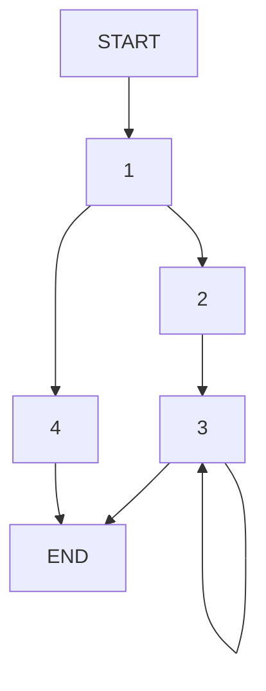

```ASM
puzzle: 
  testl %esi, %esi    ;1
  je .L4
  xorl %edx, %edx     ;2
  xorl %eax, %eax
.L3: 
  movl %edi, %ecx     ;3
  andl $1, %ecx
  addl %ecx, %eax
  sarq %rdi
  incl %edx
  cmpl %edx, %esi
  jne .L3
  ret                 ;END
.L4: 
  movl %esi, %eax     ;4
  ret                 ;END
```
```C
int puzzle(long x, unsigned n) { 
  //liczenie bitów liczby x
    if (n != 0){
        int i = 0;
        int out = 0;
        do{
            int c = x;
            out =  c & 1;
            c >>= 1;
            out++;
        }while(i == n);
    }
    return n;
}
```


