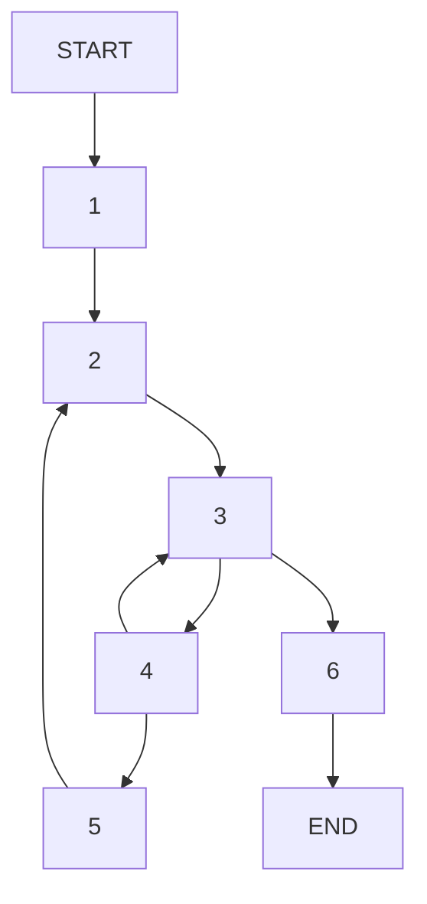

Funkcja puzzle2 sprawdza długość najdłuższego prefixu s, w którym wszystkie elementy występują w słowie d.
```ASM
puzzle2:
  movq %rdi, %rax
.L3: 
  movb (%rax), %r9b
  leaq 1(%rax), %r8
  movq %rsi, %rdx
.L2: 
  movb (%rdx), %cl
  incq %rdx
  testb %cl, %cl
  je .L4
  cmpb %cl, %r9b
  jne .L2
  movq %r8, %rax
  jmp .L3
.L4: 
  subq %rdi, %rax
  ret
```
```C
// char *t1 -> %r9b, char *t2 -> %r8, char *t3 -> %rdx, char t4 -> %cl
long puzzle2(char *s, char *d)
{
    char *result = s;
    while (true)
    {
        char t1 = *result;
        char *t2 = result+1;
        char *t3 = d;
        char t4;
        do
        {
            t4 = *t3;
            t3++;
            if (t4 == 0)
            {
                result -= s;
                return (long)result;
            }
        } while (t1 != t4);
        result = t2;
    }
}
```
