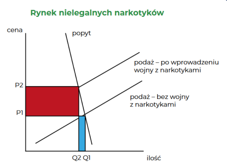

# Wykład 1 Ekonomia a handel zbożem

## koszt alternatywny

to najwyżej ceniony utracony potencjalny cel działania przy  podjęciu decyzji (pójście do kina kontra czytanie książki)

## prawo przewagi komparatywnej

czyli posiadanie niższego kosztu alternatywnego produkcji danego dobra

## prawo malejącej użyteczności krańcowej

każda kolejna jednostka dobra w  posiadaniu ma dla nas coraz mniejszą wartość, bo spełnia coraz mniej pilną potrzebę  (i tak możemy dojść do rozwiązania paradoksu wartości)

## beneficjenci wolnego handlu zbożem

# Wykład 2 Prohibicja narkotykowa

## typologia interwencji + przykłady poszczególnych typów interwencji

 - Interwenient (którego można nazwać również „napastnikiem” albo „agresorem”) to
osoba albo grupa inicjująca siłową interwencję
 - Interwencja autystyczna - interwenient ogranicza możliwość dysponowania przez
poddanego swoją własnością w sytuacji, gdy nie jest dokonywana wymiana z kimś innym
 - Interwencja dwustronna - interwenient wymusza wymianę między sobą samym i
indywidualnym poddanym albo zmusić poddanego do wręczenia mu „daru”
 - Interwencja trójstronna - napastnik wymusza wymianę między parą poddanych albo
takiej wymiany zakazać
 - Interwencja autystyczna – zakaz kultu religijnego, zakaz spożywania konkretnych
substancji, regulacje przestrzenne, ograniczenia wolności słowa
 - Interwencja dwustronna – podatki, subsydia, pobór do wojska
 - Interwencja trójstronna – zakaz handlu w niedzielę, ceny maksymalne, prawo pracy

## prohibicja a równowaga rynkowa

## przykłady dodatkowych efektów prohibicji narkotykowej

1. Wzrost mocy narkotyków
2. Ograniczenie dostępność przedmiotów używanych w połączeniu z narkotykami
3. Spadek jakości produktów
4. Wzrost przestępczości
5. „Eksport” przemocy do innych krajów
6. Brutalizacja i militaryzacja sił policyjnych
7. Ogromny wzrost liczby więźniów
8. Znaczne koszty finansowe i alternatywne

# Wykład 3 Skąd się bierze inflacja

## pieniądz a barter

Skutki istnienia pieniądza – większy podział pracy, kalkulacja ekonomiczna, finanse

## determinanty siły nabywczej pieniądza

 - Zasób pieniądza – zasada malejącej użyteczności krańcowej
 - Popyt na salda gotówkowe
Popyt na pieniądz nie jest nieograniczony – popyt na pieniądz nie jest popytem na
majątek

## przykłady współczesnych regulacji w sferze pieniądza

 - Dawniej: pieniądz kruszcowy – psucie monety
 - Później: pierwsze banki centralne. Po co? Dług publiczny
 - Regulacje bankowości:
   - Bariery wejścia
   - Regulacje kapitałowe
   - Ubezpieczenia depozytów
 - Polityka pieniężna
 - Pusty pieniądz dekretowy – banknoty stają się gotówką

## skutki współćzesnych interwencji w sferę pieniądza
 - inflacja
-  Pierwszy długotrwały kryzys z wysokim bezrobociem –Wielki Kryzys 1929 r. –
pierwszy któremu próbowano zaradzić polityką stymulacji fiskalnej i pieniężnej
-  Wcześniejsze kryzysy w USA – bardziej płytkie – powrót do produkcji sprzed kryzysu
szybciej, niż odkąd działa bank centralny
-  Złoto, srebro – globalne pieniądze
-  Obecnie świat jest pofragmentowany – zawieranie transakcji w obcych walutach
możliwe, choć kosztowne
-  Mniej handlu, mniej przepływów kapitału

## deflacja cenowa a pieniężna
 - deflacja (pieniężna), gdy spada jego podaż
 - deflacja (cenowa) ze spadkiem poziomu cen
  
## deflacja wzrostu gospodarczego
 - Wzrost produktywności gospodarki – więcej dóbr dostępnych na rynku
 - Rośnie podaż dóbr – maleją ich ceny
 - Inaczej: krańcowe jednostki dóbr zajmują coraz niższe miejsca na skalach wartości
człowieka, rośnie relatywne położenie krańcowej jednostki pieniądza
 - Tym samym rozwój gospodarczy powoduje wzrost „popytu na funkcję wymienną”
pieniądza
 - Pozytywny efekt na dobrobyt
 - Przykład – ostatnia ćwierć XIX wieku
## deflacja budowania zasobów gotówkowych
 - Wzrost „popytu rezerwowego” na pieniądz
 - Motywy – większa niepewność; chęć wyrównania konsumpcji w czasie; chęć
większych wydatków w przyszłości
 - Krańcowa jednostka pieniądza wyceniana wyżej na skali wartości niż miało to miejsce
wcześniej; większa skłonność do sprzedaży innych dóbr (np. pracy) za pieniądz
 - Także pozytywne efekty dla dobrobytu
 - Przykład – wzrost popytu na gotówkę w reakcji na pandemię
## związki deflacji i wzrostu gospodarczego
 - Deflacyjny wzrost gospodarczy
 - Deflacyjny kryzys
 - Inflacyjny wzrost gospodarczy
 - Inflacyjny kryzys
## czynniki rozwoju gospodarczego

## wzrost osczędności a rozwój gospodarczy

## instytucje sprzyjające rozwojowi gospdoarki

## rewolucja przemysłowa wg Deirdre McCloskey

## grodzenia a rewolucja przemysłowa

## niewolnictwo a rozwój gospodarczy

## arystokracja a rewolucja przemysłowa

## kolonializm a rozwój gospodarczy

## przyczyny kryzysu według Keynesistów

## przyczyny kryzysu według moentarystów

## przyczyny kryzysu według szkoły austriackiej

## polityka fiskalna i pieniężna podczas kryzysu 1920-1921

## problemy greckiej gospodarki przed 2008 rokiem

## wydatki państwa po wybuchu kryzysu 2008 roku

## składniki programów oszczędnościowych dla Grecji

## polityka fiskalna według badań Alesiny

## Popularność Bitcoina na świecie

## Bitcoin a teoremat regresji

## Bitcoin a cykle koniunkturalne

## Bitcoin a ekologia

## Definicja dóbr publicznych

## Edukacja jako dobro publiczne

## Przykłady dóbr publicznych dostarczanych prywatnie

## Dobra publiczne a subiektywizm w ekonomii

## Zmiana cen czynnika produkcji a produktywność

## potencjalne zyski ze swobodnej migracji

## Dlaczego płace mogą nie spadać przy napływie imigrantów

## Imigranci a obciążenia budżetu

## Technologiczne efekty zewnętrzne

## Koszty ograniczania zmian klimatu

## Korzyści z ograniczania zmian klimatu

## Rynkowe produkty ograniczające zmiany klimatyczne
