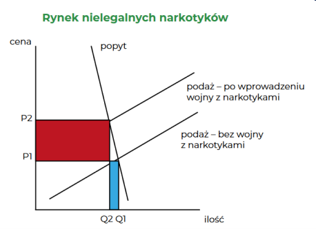
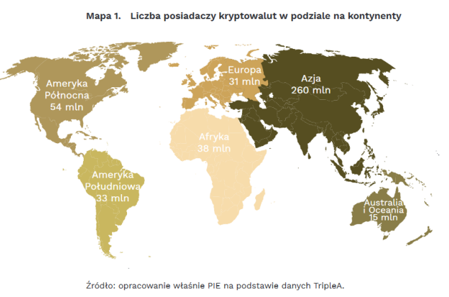
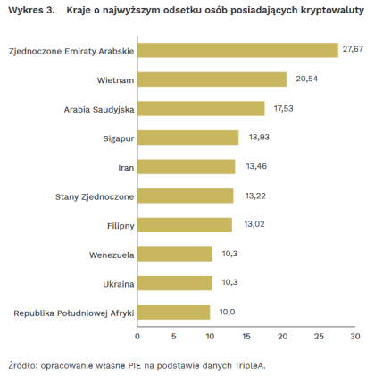

# Wykład 1 Ekonomia a handel zbożem

## koszt alternatywny

to najwyżej ceniony utracony potencjalny cel działania przy  podjęciu decyzji (pójście do kina kontra czytanie książki)

## prawo przewagi komparatywnej

czyli posiadanie niższego kosztu alternatywnego produkcji danego dobra

## prawo malejącej użyteczności krańcowej

każda kolejna jednostka dobra w  posiadaniu ma dla nas coraz mniejszą wartość, bo spełnia coraz mniej pilną potrzebę  (i tak możemy dojść do rozwiązania paradoksu wartości)

## beneficjenci wolnego handlu zbożem

# Wykład 2 Prohibicja narkotykowa

## typologia interwencji + przykłady poszczególnych typów interwencji

 - Interwenient (którego można nazwać również „napastnikiem” albo „agresorem”) to
osoba albo grupa inicjująca siłową interwencję
 - Interwencja autystyczna - interwenient ogranicza możliwość dysponowania przez
poddanego swoją własnością w sytuacji, gdy nie jest dokonywana wymiana z kimś innym
 - Interwencja dwustronna - interwenient wymusza wymianę między sobą samym i
indywidualnym poddanym albo zmusić poddanego do wręczenia mu „daru”
 - Interwencja trójstronna - napastnik wymusza wymianę między parą poddanych albo
takiej wymiany zakazać
 - Interwencja autystyczna – zakaz kultu religijnego, zakaz spożywania konkretnych
substancji, regulacje przestrzenne, ograniczenia wolności słowa
 - Interwencja dwustronna – podatki, subsydia, pobór do wojska
 - Interwencja trójstronna – zakaz handlu w niedzielę, ceny maksymalne, prawo pracy

## prohibicja a równowaga rynkowa

## przykłady dodatkowych efektów prohibicji narkotykowej

1. Wzrost mocy narkotyków
2. Ograniczenie dostępność przedmiotów używanych w połączeniu z narkotykami
3. Spadek jakości produktów
4. Wzrost przestępczości
5. „Eksport” przemocy do innych krajów
6. Brutalizacja i militaryzacja sił policyjnych
7. Ogromny wzrost liczby więźniów
8. Znaczne koszty finansowe i alternatywne

# Wykład 3 Skąd się bierze inflacja

## pieniądz a barter

Skutki istnienia pieniądza – większy podział pracy, kalkulacja ekonomiczna, finanse

## determinanty siły nabywczej pieniądza

 - Zasób pieniądza – zasada malejącej użyteczności krańcowej
 - Popyt na salda gotówkowe
Popyt na pieniądz nie jest nieograniczony – popyt na pieniądz nie jest popytem na
majątek

## przykłady współczesnych regulacji w sferze pieniądza

 - Dawniej: pieniądz kruszcowy – psucie monety
 - Później: pierwsze banki centralne. Po co? Dług publiczny
 - Regulacje bankowości:
   - Bariery wejścia
   - Regulacje kapitałowe
   - Ubezpieczenia depozytów
 - Polityka pieniężna
 - Pusty pieniądz dekretowy – banknoty stają się gotówką

## skutki współćzesnych interwencji w sferę pieniądza
 - inflacja
-  Pierwszy długotrwały kryzys z wysokim bezrobociem –Wielki Kryzys 1929 r. –
pierwszy któremu próbowano zaradzić polityką stymulacji fiskalnej i pieniężnej
-  Wcześniejsze kryzysy w USA – bardziej płytkie – powrót do produkcji sprzed kryzysu
szybciej, niż odkąd działa bank centralny
-  Złoto, srebro – globalne pieniądze
-  Obecnie świat jest pofragmentowany – zawieranie transakcji w obcych walutach
możliwe, choć kosztowne
-  Mniej handlu, mniej przepływów kapitału

# Wykład 4 Ekonomia delfacji

## deflacja cenowa a pieniężna
 - deflacja (pieniężna), gdy spada jego podaż
 - deflacja (cenowa) ze spadkiem poziomu cen
  
## deflacja wzrostu gospodarczego
 - Wzrost produktywności gospodarki – więcej dóbr dostępnych na rynku
 - Rośnie podaż dóbr – maleją ich ceny
 - Inaczej: krańcowe jednostki dóbr zajmują coraz niższe miejsca na skalach wartości
człowieka, rośnie relatywne położenie krańcowej jednostki pieniądza
 - Tym samym rozwój gospodarczy powoduje wzrost „popytu na funkcję wymienną”
pieniądza
 - Pozytywny efekt na dobrobyt
 - Przykład – ostatnia ćwierć XIX wieku
## deflacja budowania zasobów gotówkowych
 - Wzrost „popytu rezerwowego” na pieniądz
 - Motywy – większa niepewność; chęć wyrównania konsumpcji w czasie; chęć
większych wydatków w przyszłości
 - Krańcowa jednostka pieniądza wyceniana wyżej na skali wartości niż miało to miejsce
wcześniej; większa skłonność do sprzedaży innych dóbr (np. pracy) za pieniądz
 - Także pozytywne efekty dla dobrobytu
 - Przykład – wzrost popytu na gotówkę w reakcji na pandemię
## związki deflacji i wzrostu gospodarczego
 - Deflacyjny wzrost gospodarczy
 - Deflacyjny kryzys
 - Inflacyjny wzrost gospodarczy
 - Inflacyjny kryzys

# Wykład 5 Rozwój gospodarczy

## czynniki rozwoju gospodarczego + wzrost osczędności a rozwój gospodarczy

 - Wzrost ilości zasobów:
    - Pracy
    - Ziemi
 - Pogłębianie i nowe formy podziału pracy
 - Nowe technologie
 - Wzrost oszczędności i pogłębienie struktury kapitałowej
    1) Spadek popytu na dobra konsumpcyjne
    2) Wzrost inwestycji w sektorach oddalonych od konsumpcji „Efekt Ricarda”
    3) Nowa, bardziej kapitałochłonna struktura produkcji
## instytucje sprzyjające rozwojowi gospodarki
- ??
- banki
- ubezpieczalnie
## rewolucja przemysłowa wg Deirdre McCloskey
Deirdre McCloskey: dotychczasowe wytłumaczenia rewolucji przemysłowej (czynniki
instytucjonalne, handel zagraniczny, wyzysk kolonialny, dostępność węgla etc.) nie są
w stanie wytłumaczyć przytłaczającej ilości wzrostu gospodarczego, który
obserwowaliśmy

# Wykład Rozwój gospodarczy - skąd się bierze

## grodzenia a rewolucja przemysłowa
 - Grodzenia to zmiana sposobu uprawy ziemi – z wielu drobnych poletek oddalonych
od siebie na zwarte pola odgrodzone często płotami/murami/żywopłotami
 - Zamiana praw do kolektywnego korzystania z ziemi na indywidualne
 - Zarówno drogą nieformalnych porozumień, jak i aktami parlamentu
 - Zwiększenie wydajności rolnictwa
 - Na północy Anglii relatywnie wcześnie – np. XVI wiek
 - W XVIII wieku – głównie na południu – tam rewolucja przemysłowa nie wybuchła
 - Wbrew krytykom ogradzanie szło zwykle z rosnącą populacją ogradzanych wiosek, a
nie wędrującym po drogach proletariatem
## niewolnictwo a rozwój gospodarczy
 - W XVIII wieku już raczej normalne zyski z kapitału – możliwe, że większe w
przypadku samego łapania niewolników
 - Pomimo wzrostu liczby przewożonych niewolników zyski na osobę spadały
 - Relatywnie otwarty rynek, duża konkurencja, sporo czynników ryzyka
 - Dlaczego niewolnictwo zadziałało jako motor rozwoju akurat wtedy i tam?
 - Czy porzucenie niewolnictwa to wynik interesów burżuazji a nie zmian etycznych?
## arystokracja a rewolucja przemysłowa

## kolonializm a rozwój gospodarczy
Jeśli weźmie się pod uwagę koszty utrzymania kolonii i wyższe ceny płacone za
towary tam produkowane objęte protekcją celną, to dla społeczeństwa Wielkiej
Brytanii kolonie często mogły być kosztem netto; skupione korzyści – rozproszone
koszty

# Wykład 7 Spory wokół Wielkiego Kryzysu

## przyczyny kryzysu według Keynesistów
 - Interpretacja podkonsumpcyjna, keynesowska: główną przyczyną kryzysu spadek
nominalnych wydatków; ludzie zarabiają za mało, żeby wykupić produkt; zwolnienia
tylko pogłębiają ten problem;
 - Płace są sztywne w dół, więc deflacja cen konsumpcyjnych nie przekłada się na spadek
kosztów produkcji;
 - Potrzebna silna odpowiedź państwa (zwiększenie wydatków, kreowanie inwestycji),
która nastąpiła poprzez Nowy Ład Roosevelta
 - Problemy z tą interpretacją: w polityce zastosowano szereg propozycji zgłaszanych
przez ten obóz:
    - program niezmniejszania płac przez duże firmy, żeby pracownicy mogli wykupić
produkcję,
    - gwałtowny przyrost wydatków rządowych
 - Taka polityka gospodarcza szła ręka w rękę z pogłębiającym się kryzysem
## przyczyny kryzysu według monetarystów
 - Interpretacja monetarystyczna: Friedman, Schwartz,
historia monetarna USA (1963);
 - Przyczyną był gwałtowny spadek podaży pieniądza;
 - System Rezerwy Federalnej nie spełnił swojego
zadania, gdy pozwolił na spadek podaży pieniądza
 - Problemy z interpretacją monetarystyczną
    - problemy były silnie sektorowe, a nie dotykały wszystkich branż równomiernie;
    - Fed próbował wtłaczać pieniądze do gospodarki, ale mnożnik kreacji pieniądza
przestał działać – może taka polityka powodowała spadek zaufania do banków i
jeszcze większe wycofywanie złota z banków,
    - dlaczego kryzys się zaczął – duże spadki podaży pieniądza nastąpiły później
## przyczyny kryzysu według szkoły austriackiej
 - 1963 r. – Murray Rothbard, Wielki Kryzys w Ameryce
 - problemem ekspansja kredytowa podczas lat 20. Fed
podtrzymywał ją dwukrotnie, obniżając stopy, żeby nie
dopuścić do recesji.
 - Nagromadzenie błędów według ATCK – zwłaszcza w
sektorach odległych od konsumpcji.
 - Eksperyment stabilnych cen konsumpcyjnych nie
przyniósł stabilności makroekonomicznej. Przy rosnącej
produktywności ceny powinny spadać.
 - Dlaczego kryzys tak długi? Bo nie pozwolono na upłynnienie błędnych inwestycji i
restrukturyzację gospodarki.
 - Pierwszy raz zastosowano agresywną politykę fiskalną, regulacyjną i monetarną w
odpowiedzi na kryzys, przez co zasoby nie przepływały w gospodarce do lepiej
rozwijających się branż, jak to miało miejsca w latach 1920-1921, gdy stosowano
odwrotną politykę
## polityka fiskalna i pieniężna podczas kryzysu 1920-1921

# Wykład 8 Grecja i niemieckie oszczędzności

## problemy greckiej gospodarki przed 2008 rokiem
- Wejście do strefy euro – chwilowe obniżenie deficytu finansów publicznych, by
zmierzać w stronę kryteriów konwergencji
- Obniżenie oprocentowania greckiego długu – zbliżenie się do rentowności
niemieckich obligacji
- Spadek kosztów obsługi długu publicznego
- Zwiększenie innych wydatków publicznych zamiast redukcji deficytu
- Relatywnie duży sektor publiczny
- Etatyzacja życia gospodarczego
- Niska stopa zatrudnienia
- Mało konkurencyjny eksport (poza turystyką)
- Uzależnienie od strefy euro – strefa euro jako tragedia wspólnego pastwiska
## wydatki państwa po wybuchu kryzysu 2008 roku
- Do Grecji napływa pieniądz kreowany przez system bankowy strefy euro (obligacje
rządu plus kredyty dla gospodarstw domowych)
- Wraz z wybuchem kryzysu zmienia się postrzeganie ryzyka i coraz trudniej o
dodatkowe finansowanie
- Widać oznaki spowolnienia gospodarczego
- Rząd realizuje programy stymulujące gospodarkę (wyższe wydatki, wyższy deficyt
finansów publicznych)
## składniki programów oszczędnościowych dla Grecji
- Pożyczki dla Grecji udzielane pod szeregiem warunków:
  - Obniżanie wydatków
  - Podwyżki podatków
  - Reformy strukturalne
- Krytyka programów oszczędnościowych z punktu widzenia keynesowskiej
makroekonomii
- Co tu robią podwyżki podatków?
## polityka fiskalna według badań Alesiny
- Systematyczne badanie programów oszczędnościowych w krajach rozwiniętych
- Wynik – duża różnica pomiędzy cięciami wydatków a podnoszeniem podatków
- Problemy dla keynesowskiej makroekonomii

# Wykład 9 Dyskusje o Bitcoinie

## Popularność Bitcoina na świecie

<!--  -->

<!--  -->

## Bitcoin a teoremat regresji
- Teoremat regresji – potrzebny do wytłumaczenia powstania siły nabywczej
pieniądza (SNP) bez popadania w logiczne błędne koło. Skąd bierze się popyt na
pieniądz dzisiaj, który ukształtuje dzisiejszą SNP? Ze znajomości wczorajszej SNP.
Skąd wzięła się wczorajsza SNP? Ze znajomości SNP z przedwczoraj...
- Rozwiązanie – Ludwig von Mises, Theorie des Geldes und der Umlaufsmittel (1912) –
nie musimy się cofać w nieskończoność – ta regresja ma koniec. W pewnym
momencie gospodarki barterowej dobro, które zostało środkiem wymiany, było
wyceniane ze względu na jego wartość użytkową lub w produkcji innych dóbr.
- Sam Mises – nie wykluczał powstania czystego pieniądza „znakowego”/fiat money;
niektórzy jego zwolennicy (np. Murray Rothbard) – atak na koncepcję prywatnych
pustych walut, bo nie spełnią teorematu regresji
- Próby pogodzenia teorematu z Bitcoinem:
    - Bitcoin oferował coś użytecznego – np. poczucie przynależności lub system
transakcyjny
    - Bitcoin nic nie musiał spełniać, bo wszedł już do gospodarki pieniężnej – mógł
wyrobić sobie stosunek wymiany z pieniądzem bez żadnych dodatkowych warunków
## Bitcoin a cykle koniunkturalne
- Czy hipotetyczna gospodarka standardu Bitcoina byłaby makroekonomicznie
stabilna?
- Głosy za: w Bitcoinie trudno wyobrazić sobie bankowość z rezerwą cząstkową, więc
nie będzie ekspansji kredytowej, która zaburzałaby ustalanie się stopy procentowej
na rynku; każda ilość pieniądza (jeśli tylko jest podzielny) wystarczy do obsłużenia
transakcji
- Głosy przeciw: ograniczony zasób Bitcoina to recepta na deflacyjne problemy.
Wersja silniejsza: długotrwała deflacja jest ogólnie zła; Wersja słabsza: deflacja jest
OK, jeśli pochodzi ze wzrostu produktywności, ale nie jest OK, jeśli pochodzi ze
spadku szybkości obiegu pieniądza; Wersja trzecia: premia deflacyjna w BTC będzie
zbyt duża, by ustaliła się dodatnia stopa procentowa.
## Bitcoin a ekologia
- Ślad węglowy Bitcoina
- Tesla – akceptacja BTC, a potem zaprzestanie, póki BTC nie stanie się bardziej
„zielony”
- Z czym porównać ślad węglowy BTC?
- Z całym systemem bankowym, którego funkcje pełni? Potencjalnie BTC z
blockchainem ma potencjał, żeby wyeliminować duże zużycie prądu
- Sam prąd szybko staje się coraz bardziej zielony
- Kopanie BTC mogą służyć np. do produkcji ciepła
- Jakie straty ekologiczne przynosi państwowy pieniądz z rezerwą cząstkową, jeśli
ATCK ma rację?

# Wykład 11 Dlaczego państwo ma dostarczać niektóre dobra

## Definicja dóbr publicznych
dobra charakteryzujące się brakiem możliwości wyłączenia ich z konsumpcji oraz jednocześnie ich niekonkurencyjnością w konsumpcji
## Edukacja jako dobro publiczne
Edukacja jest często uważana za dobro publiczne ze względu na swoje charakterystyki. Jest to dobro, które nie może być wyłączone z konsumpcji przez jednostki oraz nie jest konkurencyjne w konsumpcji. Oznacza to, że gdy jedna osoba korzysta z edukacji, nie ogranicza to możliwości korzystania z niej przez inne osoby. Ponadto, edukacja ma istotne znaczenie dla rozwoju społeczeństwa i gospodarki, dlatego często państwo angażuje się w jej dostarczanie i finansowanie
## Przykłady dóbr publicznych dostarczanych prywatnie
Istnieje szereg dóbr publicznych, które są dostarczane przez rynek: np. fale radiowe
lub niekodowany sygnał telewizji
## Dobra publiczne a subiektywizm w ekonomii
Definicja dobra publicznego a subiektywizm w ekonomii (pacyfiści a obrona
narodowa)

# Wykład 12 Migracje a światowy dobrobyt

## Zmiana cen czynnika produkcji a produktywność
- zmiana pracy na lepiej płatną oznacza poprawę koordynacji gospodarczej – czynnik
produkcji trafia tam, gdzie przynosi większy przychód krańcowy
- ta sama zasada działa przy przekraczaniu granic – wzrost zarobków imigrantów
oznacza większą światową produkcję
- dlaczego fryzjer w Polsce zarabia więcej niż na Ukrainie, a w Niemczech więcej niż w
Polsce?
## potencjalne zyski ze swobodnej migracji
Jak duże są ewentualne zyski do znalezienia w tym względzie?

„A literature summary by Clemens (2011) cited estimates that free global labor
mobility would increase gross world product (GWP), also called “world GDP”, by
somewhere in the range of 67-147%. The estimates suggest that even partial
liberalizations of migration could yield gains greater than the estimated gains from
complete free trade or free capital flows.”
## Dlaczego płace mogą nie spadać przy napływie imigrantów
- Nowe formy podziału pracy – nowe stanowiska dla menedżerów niższego szczebla,
nowe miejsca pracy dla osób lepiej znających język i lokalną kulturę
- Nowi pracownicy będą też konsumentami – wzrasta popyt na różnego rodzaju dobra
i dochody czynników produkcji tam zatrudnionych
- Dzięki większej dostępności pracowników opłaca się podejmować inwestycje, które
wcześniej były wstrzymywane
## Imigranci a obciążenia budżetu
- USA – im młodszy imigrant, tym większe zyski netto dla budżetu przyniesie;
najbardziej „na minusie” fiskalnie są natywni mieszkańcy
- Zwiększenie liczebności populacji nie musi wcale prowadzić do większych wydatków
na czyste dobra publiczne
- „Europejski” a „amerykański” model migracji: procedura azylowa a pozwolenia na
pracę; dostęp do rynku pracy; pomoc w znalezieniu mieszkania; polityka integracji
kulturowej
- Czy najpierw należy znieść „państwo opiekuńcze”, a dopiero potem otworzyć się na
migracje?

# Wykład 13 Ekonomia a zmiany klimatyczne

## Technologiczne efekty zewnętrzne

## Koszty ograniczania zmian klimatu
- Polityka ograniczania zmian klimatycznych będzie miała swój koszt (ubytek PKB
wywołany zmianą alokacji zasobów względem wzorca wynikającego z kalkulacji
ekonomicznej)
- Zmiany klimatyczne mogą mieć czasami pozytywny wpływ na gospodarkę danego
regionu (np. wyższa temperatura umożliwia więcej rolniczych działalności; winnice
koło Wrocławia)
## Korzyści z ograniczania zmian klimatu
- Zmiany klimatyczne mogę mieć czasami negatywny wpływ na gospodarkę
(podnoszenie poziomu wód, zbyt wysokie temperatury dla większości możliwych
upraw itp.)
- Próby oszacowania tych kosztów i korzyści sugerują, że obecnie zmiany klimatyczne
będą coraz bardziej netto niekorzystne
- Istnieje koszt zewnętrzny – ludzie gospodarując prowadzą do pojawienia się strat
wśród osób, które nie są producentami (np. zalewanie wysp na Pacyfiku)
- Taka polityczna przyniesie też pewne korzyści w postaci ograniczenia szkód
wywołanych zmianą klimatu
## Rynkowe produkty ograniczające zmiany klimatyczne
- Wielu przedsiębiorców na tyle przejęło się problemem klimatu, że skoncentrowali
prawie całą swoją działalność na wdrażaniu produktów, które pozwolą na
ograniczenie emisji dwutlenku węgla i zatrzymanie/spowolnienie zmian klimatycznych
- Wykorzystują przy tym całe spektrum możliwości, jakie dają współczesne
zglobalizowane rynki (rynki kapitałowe, łańcuchy dostaw, masowość)
- Dynamiczny rozwój kilku technologii, które powodują, że eliminacja dużej części
emisji dwutlenku węgla staje się realna
- Przejście z silników spalinowych na silniki elektryczne wydatnie zwiększa
efektywność energetyczną (musimy wytwarzać dużo mniej energii, by otrzymać ten
sam rezultat)