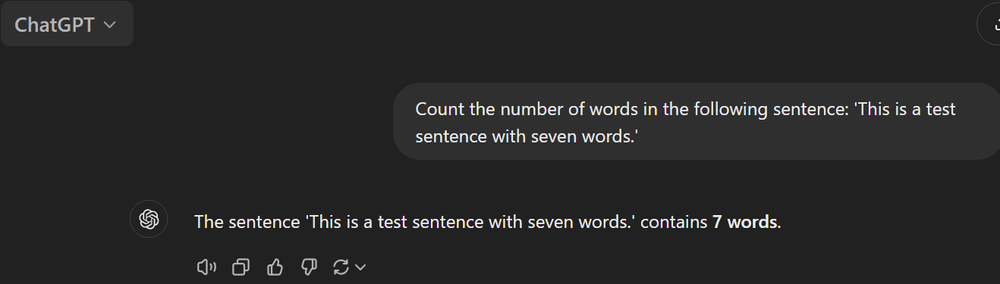

### Wymyśl rodzaj stosunkowo łatwego dla ludzi zadania (nieodwołuj¡cego się do wiedzy faktograficznej), z jasno precyzowan¡ odpowiedzi¡,1 z którym ChatGPT sobie nie radzi (alternatywnie: poka» trzy nietrywialne zadania, które Chat umie robi¢, a Cię to trochę zdziwiło)

