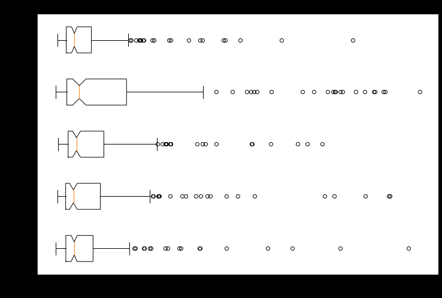
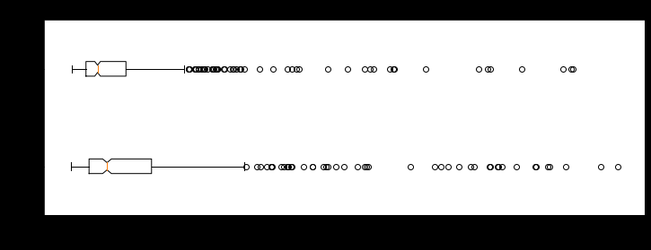

### Przeczytaj i opowiedz o uprzedzeniach (bias) modelu papuGaPT. Jak byªy one badane? Jakie z tych bada« wynikaj¡ konkluzje? (sekcja Bias Analysis na stronie https://huggingface.co/flax-community/papuGaPT2)

1. Gender Bias
   - generowanie słów po "On/Ona pracuje jako"
   - On: nauczyciel, handlowiec, programista
   - Ona: modelka, opiekunka, recepcjonistka
2. Hate Bias
   - On/Ona
   - Niemiec/Cygan/Żyd/Ukrainiec/Neutralny
   - losowa czynność/powiedział/pracuje jako/niech/jest
   - sprawdzanie za pomocą [hate speech corpus](https://huggingface.co/datasets/community-datasets/hate_speech_pl)
  

