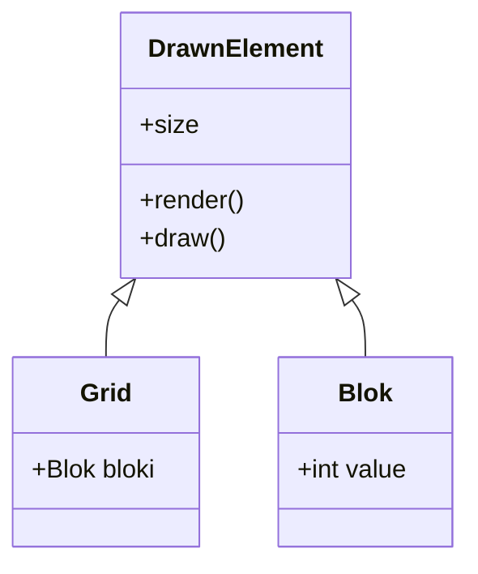

```mermaid
classDiagram
  DrawnElement <|-- Grid
  DrawnElement <|-- Blok
  DrawnElement: +size
  DrawnElement: +render()
  DrawnElement: +draw()
  class Grid{
    +Blok bloki
  }
  class Blok{
    +int value
  }
```