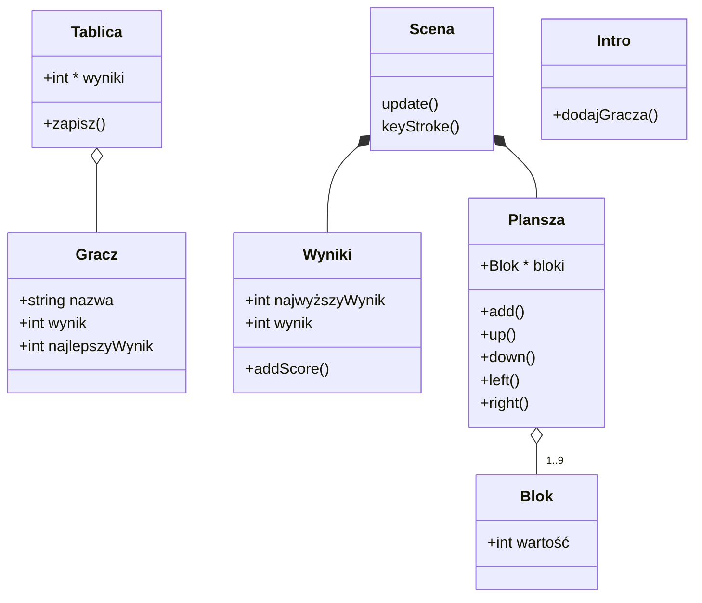

```mermaid
classDiagram
  Plansza o-- "1..9" Blok
  Tablica o-- Gracz
  Scena *-- Wyniki
  Scena *-- Plansza
  class Intro{
    +dodajGracza()
  }
  class Tablica{
    +int * wyniki
    +zapisz()
  }
  class Gracz{
    +string nazwa
    +int wynik
    +int najlepszyWynik
  }
  class Plansza{
    +Blok * bloki
    +add()
    +up()
    +down()
    +left()
    +right()
  }
  class Blok{
    +int wartość
  }
  class Wyniki{
    +int najwyższyWynik
    +int wynik
    +addScore()
  }
  class Scena{
    update()
    keyStroke()
  } 
```