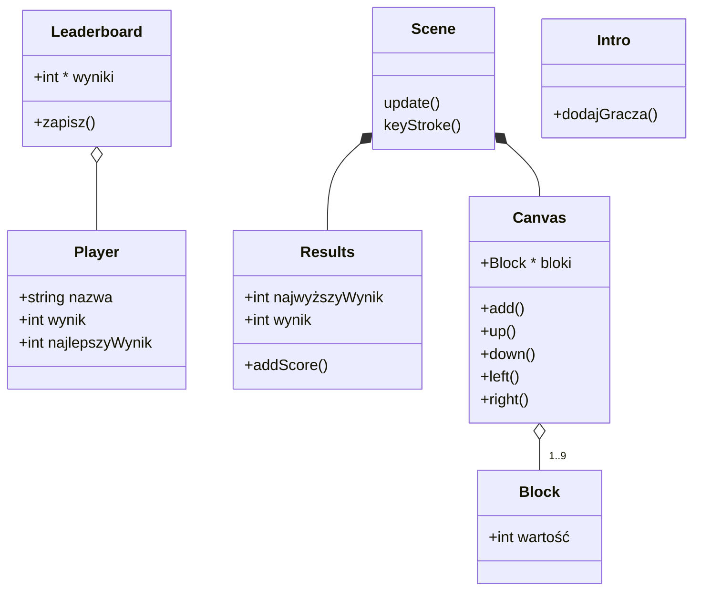

```mermaid
classDiagram
  Canvas o-- "1..9" Block
  Leaderboard o-- Player
  Scene *-- Results
  Scene *-- Canvas
  class Intro{
    +dodajGracza()
  }
  class Leaderboard{
    +int * wyniki
    +zapisz()
  }
  class Player{
    +string nazwa
    +int wynik
    +int najlepszyWynik
  }
  class Canvas{
    +Block * bloki
    +add()
    +up()
    +down()
    +left()
    +right()
  }
  class Block{
    +int wartość
  }
  class Results{
    +int najwyższyWynik
    +int wynik
    +addScore()
  }
  class Scene{
    update()
    keyStroke()
  } 
```