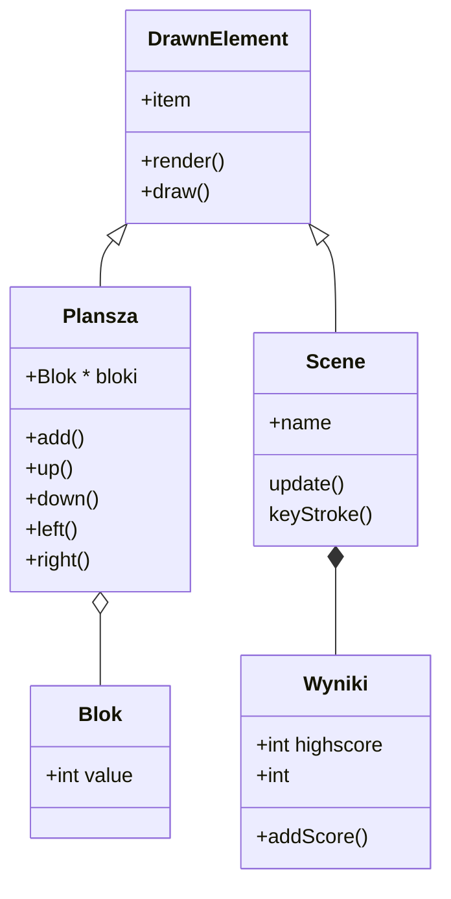

```mermaid
classDiagram
  DrawnElement <|-- Plansza
  Plansza o-- Blok
  Scene *-- Wyniki
  DrawnElement <|-- Scene
  DrawnElement: +item
  DrawnElement: +render()
  DrawnElement: +draw()
  class Plansza{
    +Blok * bloki
    +add()
    +up()
    +down()
    +left()
    +right()
  }
  class Blok{
    +int value
  }
  class Wyniki{
    +int highscore
    +int
    +addScore()
  }
  class Scene{
    +name
    update()
    keyStroke()
  } 
```