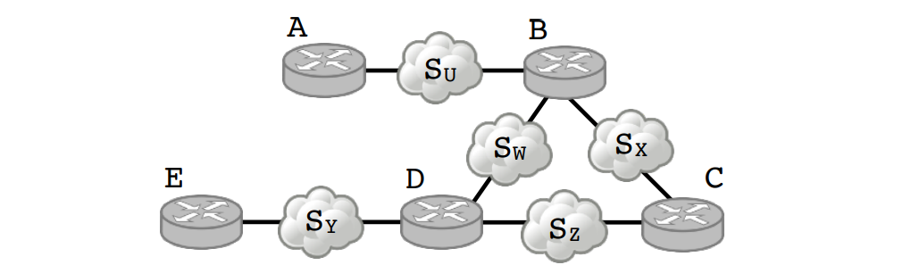
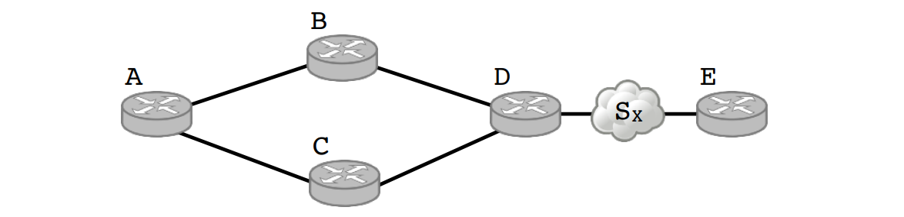
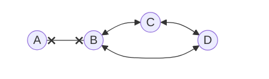

# Ćwiczenia 1
## 19.03.2025 r.

## Rafał Leja 340879

### 1. Dla każdego z podanych poniżej adresów IP w notacji CIDR określ, czy jest to adres sieci, adres rozgłoszeniowy czy też adres komputera. W każdym przypadku wyznacz odpowiadający mu adres sieci, rozgłoszeniowy i jakiś adres IP innego komputera w tej samej sieci.

- 10.1.2.3/8
  - [ ] Adres sieci: 10.0.0.0
  - [ ] Adres rozgłoszeniowy: 10.255.255.255
  - [x] **Adres komputera:** 10.1.2.3 
- 156.17.0.0/16
  - [x] **Adres sieci:** 156.17.0.0
  - [ ] Adres rozgłoszeniowy: 156.17.255.255
  - [ ] Adres komputera: 156.17.0.1
- 99.99.99.99/27
  - [ ] Adres sieci: 99.99.99.96 (**011**0 0000)
  - [ ] Adres rozgłoszeniowy: 99.99.99.127 (**011**1 1111)
  - [x] **Adres komputera:** 99.99.99.99 (**011**0 0011)
- 156.17.64.4/30
  - [x] **Adres sieci:** 156.17.64.4 (**0000 01**00)
  - [ ] Adres rozgłoszeniowy: 156.17.64.7 (**0000 01**11)
  - [ ] Adres komputera: 156.17.64.5 (**0000 01**01)
- 123.123.123.123/32
  - [ ] Adres sieci: -
  - [ ] Adres rozgłoszeniowy: -
  - [x] **Adres komputera:** 123.123.123.123
  
### 2. Podziel sieć 10.10.0.0/16 na 5 rozłącznych podsieci, tak aby każdy z adresów IP z sieci 10.10.0.0/16 był w jednej z tych 5 podsieci. Jak zmieniła się liczba adresów IP możliwych do użycia przy adresowaniu komputerów? Jaki jest minimalny rozmiar podsieci, który możesz uzyskać w ten sposób?

1. 10.10.0.0/17: 32,768 adresów IP
2. 10.10.128.0/18: 16,384 adresów IP
3. 10.10.192.0/19: 8,192 adresów IP
4. 10.10.224.0/20: 4,096 adresów IP
5. 10.10.240.0/20: 4,096 adresów IP

$\pagebreak$

Liczba adresów IP możliwych do użycia przy adresowaniu komputerów \
 zmniejszyła się z
$$65536 - 2 = 65534$$
do
$$32,768 + 16,384 + 8,192 + 4,096 + 4,096 - 5 \cdot 2 = 65526$$

Minimalny rozmiar podsieci, który można uzyskać w ten sposób to 2^12 = 4,096 adresy IP.

### 3. Tablica routingu zawiera następujące wpisy (podsieć → dokąd wysłać):

- 0.0.0.0/0 → do routera A
- 10.0.0.0/23 → do routera B
- 10.0.2.0/24 → do routera B
- 10.0.3.0/24 → do routera B
- 10.0.1.0/24 → do routera C
- 10.0.0.128/25 → do routera B
- 10.0.1.8/29 → do routera B
- 10.0.1.16/29 → do routera B
- 10.0.1.24/29 → do routera B

### Napisz równoważną tablicę routingu zawierającą jak najmniej wpisów.

Rozpiszmy zakresy adresów IP dla podsieci B i C:

- B:

$[10.0.0.0, 10.0.1.255] \bigcup$ 
$[10.0.2.0, 10.0.2.255] \bigcup$ 
$[10.0.3.0, 10.0.3.255] \bigcup$ 
$[10.0.0.128, 10.0.0.255] \bigcup$ \
$[10.0.1.8, 10.0.1.15] \bigcup$ 
$[10.0.1.16, 10.0.1.23] \bigcup$ 
$[10.0.1.24, 10.0.1.31] =$ \
$[10.0.0.0, 10.0.3.255] \Rightarrow 10.0.0.0/22$

- C:

$[10.0.1.0, 10.0.1.255]$ $\backslash$ $[10.0.1.8, 10.0.1.31]$ 

  
Zoptymalizowana tablica:

- 0.0.0.0/0 → do routera A
- 10.0.0.0/22 → do routera B
- 10.0.1.0/24 → do routera C
- 10.0.1.8/29 → do routera B
- 10.0.1.16/28 → do routera B

$\pagebreak$

### 4. Wykonaj powyższe zadanie dla tablicy:

- 0.0.0.0/0 → do routera A
- 10.0.0.0/8 → do routera B
- 10.3.0.0/24 → do routera C
- 10.3.0.32/27 → do routera B
- 10.3.0.64/27 → do routera B
- 10.3.0.96/27 → do routera B

Rozpiszmy zakresy adresów IP dla podsieci C:

$[10.3.0.0, 10.3.0.255]$ $\backslash$ 
$[10.3.0.32, 10.3.0.63]$ $\backslash$ 
$[10.3.0.64, 10.3.0.95]$ $\backslash$ 
$[10.3.0.96, 10.3.0.127]$ =
$[10.3.0.0, 10.3.0.31]$ $\bigcup$ $[10.3.0.128, 10.3.0.255]$ \
$\Rightarrow$ $10.3.0.0/27$; $10.3.0.128/25$

Zoptymalizowana tablica:

- 0.0.0.0/0 → do routera A
- 10.0.0.0/8 → do routera B
- 10.3.0.0/27 → do routera C
- 10.3.0.128/25 → do routera C

### 5. Jak uporządkować wpisy w tablicy routingu, żeby zasada najlepszego dopasowania odpowiadała wyborowi „pierwszy pasujący” (tj. przeglądaniu tablicy od początku do końca aż do momentu napotkania dowolnej pasującej reguły)? Odpowiedź uzasadnij formalnie.

Należy posortować wpisy w tablicy routingu w kolejności malejącej długości prefiksu. 

Rozważmy adres IP oznaczony jako $a$.
Niech $x$ oraz $y$ będą kolejnymi wpisami w tablicy routingu. Załóżmy że $a$ pasuje do $x$ na $n$ bitach. Skoro wpisy są posortowane malejąco, to $a$ nie pasuje do $y$ na więcej niż $n$ bitach. W przeciwnym przypadku $y$ miałby dłuższy prefiks niż $x$.

$\pagebreak$

### 6. W podanej niżej sieci tablice routingu budowane są za pomocą algorytmu wektora odległości. Pokaż (krok po kroku), jak będzie się to odbywać. W ilu krokach zostanie osiągnięty stan stabilny?

Krok 0:

sieci \\ routery   | A | B | C | D | E
---|---|---|---|---|---
SU | 1 | 1 | _ | _ | _
SW | _ | 1 | _ | 1 | _
SX | _ | 1 | 1 | _ | _
SY | _ | _ | _ | 1 | 1
SZ | _ | _ | 1 | 1 | _

Krok 1: 

sieci \\ routery   | A | B | C | D | E
---|---|---|---|---|---
SU | 1 | 1 | 2(B) | 2(B) | _
SW | 2(B) | 1 | 2(B) | 1 | 2(D)
SX | 2(B) | 1 | 1 | 2(C) | _
SY | _ | 2(D) | 2(D) | 1 | 1
SZ | _ | 2(C) | 1 | 1 | 2(D)

Krok 2: -> **stan stabilny**

sieci \\ routery   | A | B | C | D | E
---|---|---|---|---|---
SU | 1 | 1 | 2(B) | 2(B) | 3(D)
SW | 2(B) | 1 | 2(B) | 1 | 2(D)
SX | 2(B) | 1 | 1 | 2(C) | 3(D)
SY | 3(B) | 2(D) | 2(D) | 1 | 1
SZ | 3(B) | 2(C) | 1 | 1 | 2(D)

### 7. Załóżmy, że w powyższej sieci tablice routingu zostały już zbudowane. Co będzie się działo (krok po kroku), jeśli zostanie dodana sieć SQ łącząca routery A i E?

Krok 0:

sieci \\ routery   | A | B | C | D | E
---|---|---|---|---|---
SU | 1 | 1 | 2(B) | 2(B) | 3(D)
SW | 2(B) | 1 | 2(B) | 1 | 2(D)
SX | 2(B) | 1 | 1 | 2(C) | 3(D)
SY | 3(B) | 2(D) | 2(D) | 1 | 1
SZ | 3(B) | 2(C) | 1 | 1 | 2(D)
SQ | 1 | _ | _ | _ | 1

Krok 1:

sieci \\ routery   | A | B | C | D | E
---|---|---|---|---|---
SU | 1 | 1 | 2(B) | 2(B) | 3(D)
SW | 2(B) | 1 | 2(B) | 1 | 2(D)
SX | 2(B) | 1 | 1 | 2(C) | 3(D)
SY | 3(B) | 2(D) | 2(D) | 1 | 1
SZ | 3(B) | 2(C) | 1 | 1 | 2(D)
SQ | 1 | 2(A) | _ | 2(D) | 1

Krok 2: -> **stan stabilny**

sieci \\ routery   | A | B | C | D | E
---|---|---|---|---|---
SU | 1 | 1 | 2(B) | 2(B) | 3(D)
SW | 2(B) | 1 | 2(B) | 1 | 2(D)
SX | 2(B) | 1 | 1 | 2(C) | 3(D)
SY | 3(B) | 2(D) | 2(D) | 1 | 1
SZ | 3(B) | 2(C) | 1 | 1 | 2(D)
SQ | 1 | 2(A) | 3(B) | 2(D) | 1

### 8. W przedstawionej poniżej sieci uszkodzeniu ulega połączenie między routerami D i E. Załóżmy, że w sieci działa algorytm wektora odległości wykorzystujący technikę zatruwania ścieżki zwrotnej (poison reverse). Pokaż — opisując krok po kroku jakie komunikaty są przesyłane między routerami — że może powstać cykl w routingu.

Zakładam że połączenie między D i Sx jest uszkodzone.

- **Poison reverse** - Jeśli router X jest wpisany jako następny router na ścieżce do S, to wysyłamy do X informację „mam do S ścieżkę nieskończoną“.

Komunikaty:

1. D -> B: „mam do SX ścieżkę nieskończoną“
2. B -> A: „mam do SX ścieżkę nieskończoną“
3. C -> A: "mam do SX 2 kroki, przez D"
4. A -> B: "mam do SX 3 kroki, przez C"
5. B -> D: "mam do SX 4 kroki, przez A"
6. D -> C: "mam do SX 5 kroków, przez B"
7. C -> A: "mam do SX 6 kroków, przez D"
8. …

Krok | _ | A | B | C | D | E
-----|---|---|---|---|---|---
 0 | SX | 3(B) | 2(D) | 2(D) | $\infty$ | $\infty$
 1 | SX | 3(B) | $\infty$ | 2(D) | $\infty$ | $\infty$
 2 | SX | $\infty$ | $\infty$ | 2(D) | $\infty$ | $\infty$
 3 | SX | 3(C) | $\infty$ | 2(D) | $\infty$ | $\infty$
 4 | SX | 3(C) | 4(A) | 2(D) | $\infty$ | $\infty$
 5 | SX | 3(C) | 4(A) | 2(D) | 5(B) | $\infty$
 6 | SX | 3(C) | 4(A) | 6(D) | 5(B) | $\infty$
 7 | SX | 7(C) | 4(A) | 6(D) | 5(B) | $\infty$
...|
 N | SX | N(C) | N-3(A) | N-1(D) | N-2(B) | $\infty$

### 9. Pokaż, że przy wykorzystaniu algorytmu stanu łączy też może powstać cykl w routingu. W tym celu skonstruuj sieć z dwoma wyróżnionymi, sąsiadującymi ze sobą routerami A i B. Załóż, że wszystkie routery znają graf całej sieci. W pewnym momencie łącze między A i B ulega awarii, o czym A i B od razu się dowiadują. Zalewają one sieć odpowiednią aktualizacją. Pokaż, że w okresie propagowania tej aktualizacji (kiedy dotarła ona już do części routerów a do części nie) może powstać cykl w routingu.

Krok 0:

 _ | A | B | C | D 
---|---|---|---|---
 A | 0 | 1 | 2(B) | 2 (B)
 B | 1 | 0 | 1 | 1 
 C | 2(B) | 1 | 0 | 1
 D | 2(B) | 1 | 1 | 0

Krok 1: uszkodzenie

 _ | A | B | C | D 
---|---|---|---|---
 A | 0 | $\infty$ | 2(B) | 2 (B)
 B | $\infty$ | 0 | 1 | 1 
 C | 2(B) | 1 | 0 | 1
 D | 2(B) | 1 | 1 | 0

Krok 2:

- A: "nie mam połączenia z B, aktualizuje swoją tablicę"
- C -> D "mam do A 2 kroki, przez B"
- B -> C "mam do A ścieżkę nieskończoną"

 _ | A | B | C | D 
---|---|---|---|---
 A | 0 | $\infty$ | $\infty$ | 2 (B)
 B | $\infty$ | 0 | 1 | 1 
 C | $\infty$ | 1 | 0 | 1
 D | $\infty$ | 1 | 1 | 0