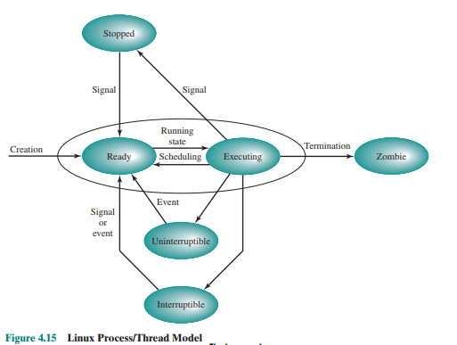

### Na podstawie rysunku 4.15 z §4.6 przedstaw stany procesu w systemie Linux. 

### Podaj akcje albo zdarzenia wyzwalające zmianę stanu. 
 - Sysgnał
 - Zakończenie działania
 - Event np. i/o
 - Planowanie


### Które przejścia mogą być rezultatem działań podejmowanych przez: jądro systemu operacyjnego, kod sterowników, proces użytkownika? 
- Jądro systemu operacyjnego: 
    - Ready -> Executing
    - Executing -> Ready
    - Executing -> Stopped
    - Stopped -> Ready
    - Interruptible -> Ready
    - Executing -> Zombie
- Kod sterowników:
    - Uninterruptible -> Ready
    - Interruptible -> Ready
- Proces użytkownika:
    - Executing -> Stopped
    - Stopped -> Ready
    - Interruptible -> Ready
    - Creation

### Wyjaśnij różnice między snem przerywalnym i nieprzerywalnym. Czy proces może zablokować lub zignorować sygnał «SIGKILL» lub «SIGSEGV»?

```
The difference between this and
the Interruptible state is that in an Uninterruptible state, a process is waiting
directly on hardware conditions and therefore will not handle any signals.
```
Uninterruptible - proces czeka na zdarzenie sprzętowe, nie obsługuje sygnałów
Interruptible - proces czeka na zdarzenie sprzętowe, obsługuje sygnały

- blokowanie sygnałów to odkładanie ich obsługi na później ( kiedy flaga blokowania zostanie zdjęta )
- ignorowanie sygnałów to przekazywanie ich do "pustej" obsługi wyjątków

SIGKILL - nie może być zablokowany ani zignorowany
SIGSEGV - może być zablokowany i może być zignorowany ( co może nie przynieść zamierzonego efektu, bo proces wróci do instrukcji, która spowodowała błąd )

```
It is not possible to block SIGKILL or SIGSTOP.  Attempts to do
so are silently ignored.

(...)

If SIGBUS, SIGFPE, SIGILL, or SIGSEGV are generated while they
are blocked, the result is undefined, unless the signal was
generated by kill(2), sigqueue(3), or raise(3).

                                         - man sigprocmask(2)
```