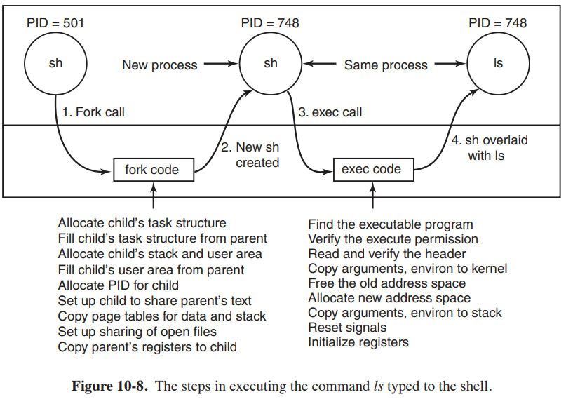

### Wyjaśnij różnice w tworzeniu procesów w systemie Linux (§10.3.3) i WinNT (§11.4.3).
| Cechy                  | **Linux**                                 | **Windows NT**                           |
|------------------------|-------------------------------------------|------------------------------------------|
| **Główne wywołania**    | `fork()`, `exec()`                        | `CreateProcess()`                        |
| **Tworzenie procesu**   | Oddzielne wywołania do tworzenia procesu i zamiany programu (rozdzielenie `fork()` i `exec()`) | Proces i program są tworzone w jednym wywołaniu (`CreateProcess()`) |
| **Pamięć**              | Współdzielenie pamięci dzięki mechanizmowi COW | Oddzielna przestrzeń pamięciowa dla każdego procesu, brak COW |
| **Wątki**               | Procesy mogą mieć wiele wątków, ale podstawową jednostką są procesy | Wątki są podstawową jednostką wykonawczą |
| **Zarządzanie procesami** | Proces potomny jest kopią procesu macierzystego | Proces potomny nie jest kopią procesu macierzystego |
| **Mechanizmy bezpieczeństwa** | Brak oddzielnych tokenów, ale kontrola przez użytkowników i grupy | Tokeny bezpieczeństwa przyznawane na poziomie procesu |

### Naszkicuj przebieg najważniejszych akcji podejmowanych przez jądro w trakcie obsługi funkcji fork(2) i execve(2).

### Załóżmy, że system posiada wywołanie spawn, o takich samych argumentach jak execve. Zastępuje ono parę wywołań fork i execve, a realizuje takie samo zadanie. Dlaczego w takim przypadku mielibyśmy problemy z dodaniem do powłoki obsługi przekierowania standardowego wejścia/wyjścia odpowiednio z/do pliku albo łączenia dowolnych procesów potokami?
 Wykonać fork() w celu utworzenia procesu dziecka.
- Następnie w dziecku ustawić przekierowania deskryptorów plików (np. standardowe wejście/wyjście do plików lub potoków).
- Dopiero po przekierowaniu deskryptorów plików wywołać execve(), aby uruchomić nowy program, mając pewność, że korzysta on z odpowiednio ustawionych wejść/wyjść.

W przypadku wywołania spawn, które bezpośrednio tworzy nowy proces i uruchamia w nim program, nie ma miejsca na ustawienie przekierowań przed załadowaniem programu. W efekcie nie da się przekierować standardowego wejścia/wyjścia do plików, ponieważ program już jest uruchomiony. Tworzenie potoków między procesami staje się problematyczne, ponieważ procesy muszą mieć skonfigurowane deskryptory plików przed rozpoczęciem wykonywania kodu, co w przypadku spawn jest trudne lub niemożliwe do zrealizowania.