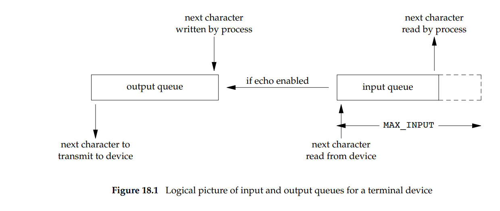

### Zapoznaj się z paragrafami „Canonical Mode Input Processing”, „Special Characters” i „Writing Data and Output Processing” podręcznika termios(4). Jak zachowuje się sterownik terminala działającego w trybie kanonicznym? 

In canonical mode:

       * Input is made available line by line.  An  input  line  is  available
         when  one  of  the line delimiters is typed (NL, EOL, EOL2; or EOF at
         the start of line).  Except in the case of EOF, the line delimiter is
         included in the buffer returned by read(2).

       * Line  editing is enabled (ERASE, KILL; and if the IEXTEN flag is set:
         WERASE, REPRINT, LNEXT).  A read(2) returns at most one line  of  in‐
         put;  if  the read(2) requested fewer bytes than are available in the
         current line of input, then only as many bytes as requested are read,
         and the remaining characters will be available for a future read(2).

       * The maximum line length is 4096 chars (including the terminating new‐
         line character); lines longer than 4096 chars are  truncated.   After
         4095  characters,  input processing (e.g., ISIG and ECHO* processing)
         continues, but any input data after 4095 characters up  to  (but  not
         including)  any  terminating newline is discarded.  This ensures that
         the terminal can always receive more input until at  least  one  line
         can be read.

### Posługując się rysunkiem [1, 62-1] wytłumacz w jaki sposób przetwarza on znaki (w tym kody sterujące) wchodzące do kolejki wejściowej i kolejki wyjściowej. 

### Jak konfigurację terminala powinien zmienić program na czas wpisywania hasła przez użytkownika?

wyłączyć tryb kanoniczny - brak buforowania
wyłączyć echo - znaki nie będą wypisywane w terminalu

### Czemu edytory takie jak vi(1) konfigurują sterownik terminala do pracy w trybie niekanonicznym?

potrzebują natychmiastowego reagowania na wejście