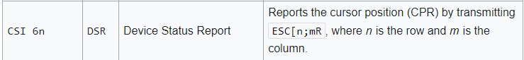

### W bieżącej wersji biblioteki «libcsapp» znajdują się pliki «terminal.h» i «terminal.c». Przeczytaj [2, 62.1 i 62.2], a następnie zreferuj działanie procedury «tty_curpos» odczytującej pozycję kursora terminala.

```C
#define CPR() CSI "6n"              /* Cursor Position Report */

void tty_curpos(int fd, int *x, int *y) {
  struct termios ts, ots; // strukty przechowujące ustawienia terminala

  tcgetattr(fd, &ts); // pobranie ustawień terminala
  memcpy(&ots, &ts, sizeof(struct termios)); // kopia ustawień terminala
  // lflag - flagi kontrolujące interfejs użytkownika
  ts.c_lflag &= ~(ECHO | ICANON); // wyłączenie flag ECHO i ICANON 
  // cflag - flags relating to hardware control of the terminal line
  ts.c_cflag &= ~CREAD; // wyłączenie flagi CREAD, (Allow input to be received)
  tcsetattr(fd, TCSADRAIN, &ts); // ustawienie nowych ustawień terminala

  /* How many characters in the input queue. */
  int m = 0;
  /* TODO: Need to figure out some other way to do it on MacOS / FreeBSD. */

// zwraca liczbę znaków w kolejce wejściowej
#ifdef LINUX
  ioctl(fd, TIOCINQ, &m); 
#endif

  /* Read them all. */
  char discarded[m];
  m = Read(fd, discarded, m); // odczytanie znaków z terminala

  Write(fd, CPR(), sizeof(CPR())); // wypisanie kodu sterującego CPR
  char buf[20];
  int n = Read(fd, buf, 19); // odczytanie odpowiedzi terminala
  buf[n] = '\0';

  ts.c_lflag |= ICANON; // włączenie flagi ICANON
  tcsetattr(fd, TCSADRAIN, &ts); // ustawienie nowych ustawień terminala
  for (int i = 0; i < m; i++)
    ioctl(fd, TIOCSTI, discarded + i); // wstawienie znaków do kolejki wejściowej

  tcsetattr(fd, TCSADRAIN, &ots); // przywrócenie poprzednich ustawień terminala
  sscanf(buf, "\033[%d;%dR", x, y); // odczytanie pozycji kursora
}
```

### Do czego służy kod sterujący «CPR» opisany w CSI sequences1?


### Posiłkując się tty_ioctl(4) wytłumacz semantykę rozkazów «TCGETS» i «TCSETSW», wykorzystywanych odpowiednio przez tcgetattr(3) i tcsetattr(3), oraz «TIOCINQ» i «TIOCSTI».


- TCGETS - pobiera ustawienia terminala
- TCSETSW - ustawia ustawienia terminala, pozwól na wyczyszczenie bufora wyjściowego
- TIOCINQ - zwraca liczbę bajtów w kolejce wejściowej
- TIOCSTI - wstawia znak do kolejki wejściowej

### Na podstawie termios(4) wyjaśnij jak flagi «ECHO», «ICANON», «CREAD» wpływają na działanie sterownika terminala.

- ECHO - wypisywanie znaków z wejścia do kolejki wyjściowej
- ICANON - tryb kanoniczny, w którym znaki są przetwarzane linia po linii
- CREAD - If CREAD	is set,	the receiver is	enabled.  Otherwise, no	 character  is
       received.   Not	all hardware supports this bit.	 In fact, this flag is
       pretty silly and	if it were not part of the  termios  specification  it
       would be	omitted.