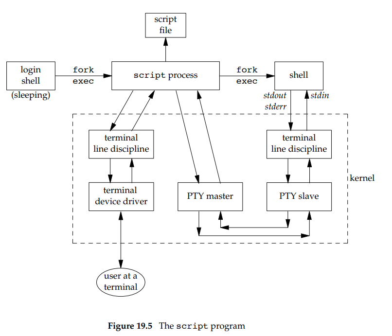

### Na podstawie [1, 19.2] wyjaśnij działanie programu script(1). 
script wstawia się miedzy terminalem a login shellem, zapisuje wszystkie znaki wychodzące z terminala do pliku, a wszystkie znaki przychodzące z pliku do terminala.



### Nagraj interaktywną sesję z powłoką «dash» przy pomocy polecenia «script -T timing -c dash». Wykonaj kilka poleceń i zakończ powłokę przy pomocy polecenia «exit 42», po czym odtwórz sesję przy pomocy polecenia «scriptreplay -t timing». 
```bash
script -T timing -c dash
echo "Hello World"
exit 42
scriptreplay -t timing
```
### Następnie uruchom polecenie powyższe polecenie przy pomocy «strace -f -e read,write -o script.log» i na podstawie zawartości pliku «script.log» pokaż jak «script» używa pseudoterminala do komunikacji z programami działającymi pod kontrolą powłoki «dash». 
```bash
strace -f -e read,write -o script.log script -T timing -c dash
cat script.log

22848 read(3, "\177ELF\2\1\1\3\0\0\0\0\0\0\0\0\3\0>\0\1\0\0\0P\237\2\0\0\0\0\0"..., 832) = 832
22848 read(3, "# Locale name alias data base.\n#"..., 4096) = 2996
22848 read(3, "", 4096)                 = 0
22848 write(1, "Script started, output log file "..., 74) = 74
22848 read(7, "TZif2\0\0\0\0\0\0\0\0\0\0\0\0\0\0\0\0\0\0\v\0\0\0\v\0\0\0\0"..., 4096) = 2654
22848 read(7, "TZif2\0\0\0\0\0\0\0\0\0\0\0\0\0\0\0\0\0\0\v\0\0\0\v\0\0\0\0"..., 4096) = 1671
22849 read(3, "\177ELF\2\1\1\0\0\0\0\0\0\0\0\0\3\0>\0\1\0\0\0\0\0\0\0\0\0\0\0"..., 832) = 832
22849 read(3, "\177ELF\2\1\1\3\0\0\0\0\0\0\0\0\3\0>\0\1\0\0\0P\237\2\0\0\0\0\0"..., 832) = 832
22849 read(3, "# Locale name alias data base.\n#"..., 4096) = 2996
22849 read(3, "", 4096)                 = 0
22849 read(3, "\177ELF\2\1\1\3\0\0\0\0\0\0\0\0\3\0>\0\1\0\0\0P\237\2\0\0\0\0\0"..., 832) = 832
22849 write(2, "$ ", 2)                 = 2
22849 read(0,  <unfinished ...>
22848 read(3, "$ ", 8192)               = 2
22848 write(1, "$ ", 2)                 = 2
22848 read(0, "e", 8192)                = 1
22848 write(3, "e", 1)                  = 1
```

pseudoterminal - coś co wygląda jak terminal, ale jest programem, który działa jak terminal

### Pokaż, że sterownik terminala przepisuje znaki zgodnie z flagami «ICRNL» i «ONLCR» opisanymi w termios(4).
If INLCR is set, a received NL character is translated into a CR charac-
     ter.  If IGNCR is set, a received CR character is ignored (not read).  If
     IGNCR is not set and ICRNL is set, a received CR character is translated
     into a NL character.

If OCRNL is set, carriage returns are translated to newlines.

```bash
29841 read(3, "$ ", 8192)               = 2
29841 write(1, "$ ", 2)                 = 2
29841 read(0, "\r", 8192)               = 1
29841 write(3, "\r", 1)                 = 1
29842 <... read resumed>"\n", 8192)     = 1
29842 write(2, "$ ", 2)                 = 2
29842 read(0,  <unfinished ...>
29841 read(3, "\r\n$ ", 8192)           = 4
29841 write(1, "\r\n$ ", 4)             = 4
```