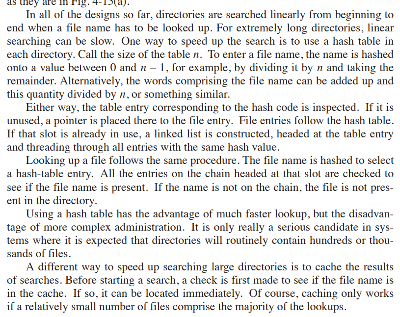

### Czemu nie można czytać i modyfikować katalogów przy pomocy wywołań read(2) i write(2)?
aby użyć read i write potrzebujemy deskryptora pliku, 
który jest zwracany przez open(2)
gdy uruchamiamy read(2) na katalogu, otrzymujemy błąd EISDIR

### Jakim wywołaniem systemowym można wczytać rekord katalogu (ang. directory entry )? 
aby odczytać katalog, używamy wywołania systemowego opendir(3) oraz readdir(3)

### Dlaczego zawartość katalogu nie jest posortowana? 
```bash
ls -U
```


zależy to od implementacji systemu plików,
np. kolejność wierzchołków w B-drzewie lub tablicy haszującej

### Wyświetl metadane katalogu głównego «/» przy pomocy polecenia «stat», a następnie wyjaśnij z czego wynika podana liczba dowiązań (ang. hard link)?
```bash
stat -c %h /

19

ls -al / | grep dr* | wc -l
```