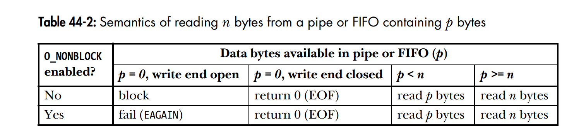
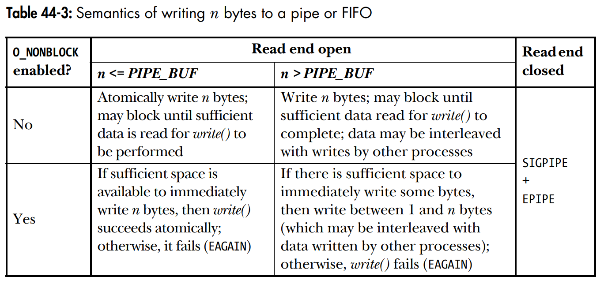

### Rura pipe(7) to jednokierunkowe narzędzie do komunikacji międzyprocesowej. Co robi operacja read(2) i write(2), jeśli bufor rury jest odpowiednio pusty albo pełny?
 - read jeśli bufor jest pusty: 
   - drugi koniec rury jest zamknięty, read zwróci EOF
   - drugi koniec rury jest otwary, read czeka na znak
 - write jeśli bufor jest pełny:
   - drugi koniec jest zamknięty, program otrzyma SIGPIPE
   - drugi koniec jest otwarty, program czeka aż inny program odczyta znaki z drugiego końca

"If a process attempts to read from an empty pipe, then read(2) will block until  data  is  avail‐
       able.  If a process attempts to write to a full pipe (see below), then write(2) blocks until suf‐
       ficient data has been read from the pipe to allow the write to complete."
--- man 7 pipe

### Jakie gwarancje daje nam operacja write na rurze, do której pisze wiele procesów – każdy z nich wiersze tekstu nie dłuższe niż «PIPE_BUF»?
znaki nie będą przemieszane
"POSIX.1 says that write(2)s of less than PIPE_BUF bytes must be atomic: the output data is  writ‐
       ten  to  the pipe as a contiguous sequence."
- man 7 pipe

### Weźmy potok utworzony poleceniem «ps -ef | grep sh | wc -l». Czemu wszystkie procesy należące do potoku zakończą się bez interwencji powłoki, jeśli co najmniej jeden z nich umrze?
ps ma skończony wydruk, po którym się zamyka. Wtedy grep dostaje EOF, drukuje wynik i również się zamyka, analogicznie wc

jeśli grep lub wc zakończy działanie przed ps, to ps otrzyma SIGPIPE i zakończy działanie

### Kiedy operacje read i write na rurze zwracają „short count”?

jeśli rura zawiera mniej bajtów

### Jak można połączyć rodzica i dziecko rurą, która została utworzona po uruchomieniu dziecka?

nie da sie 
"However, pipes can be used for communication between any two (or more) related processes, as long as the pipe was created
by a common ancestor before the series of fork() calls that led to the existence of
the processes. "
- LPI s. 894