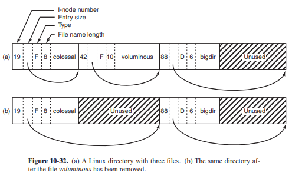

## W systemach uniksowych katalog to ciąg bajtów reprezentujący listy rekordów dirent(3). Na podstawie [3, rysunek 10-32] przedstaw reprezentację katalogu, a następnie wyjaśnij jak przebiegają operacje usuwania i dodawania pliku. W pierwszym przypadku rozważ scenariusz, w którym w reprezentacji katalogu za lub przed usuwanym wpisem istnieją nieużytki. W drugim, kiedy w pliku katalogu nie udaje się znaleźć wystarczająco dużo miejsca na przechowanie wpisu.

### Jądro leniwie wykonuje operację kompaktowania na katalogach – kiedy opłaca się ją zrobić?