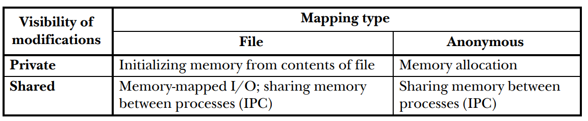

### Na podstawie opisu do [3, tabeli 49 –1] podaj scenariusze użycia prywatnych i dzielonych odwzorowań plików w pamięć albo pamięci anonimowej.


| Visibility of modifications | File mapping | Anonymous mapping |
|-----------------------------|--------------|-------------------|
| Private                     | Initializing memory from contents of file| Memory allocation     |
| Shared                      | Memory-mapped I/O; sharing memory between processes (IPC) | Sharing memory between processes (IPC) |

- Prywatne odwzorowanie pliku w pamięć:
  - Inicjalizacja pamięci z zawartości pliku

- Dzielone odwzorowanie pliku w pamięć:
    - I/O odwzorowania pliku w pamięć, alternatywa read/write; dzielenie pamięci między procesami (IPC)

- Prywatne odwzorowanie pamięci anonimowej:
    - Alokacja pamięci

- Dzielone odwzorowanie pamięci anonimowej:
    - Dzielenie pamięci między procesami (IPC)

### Pokaż jak je utworzyć z użyciem wywołania mmap(2).

```c

#define FILE_SIZE 4096

void *mmap(void *addr, size_t length, int prot, int flags, int fd, off_t offset);

// Prywatne odwzorowanie pliku w pamięć
void *addr = mmap(NULL, FILE_SIZE, PROT_READ | PROT_WRITE, MAP_PRIVATE, fd, 0);

// Dzielone odwzorowanie pliku w pamięć
void *addr = mmap(NULL, FILE_SIZE, PROT_READ | PROT_WRITE, MAP_SHARED, fd, 0);

// Prywatne odwzorowanie pamięci anonimowej
void *addr = mmap(NULL, FILE_SIZE, PROT_READ | PROT_WRITE, MAP_PRIVATE | MAP_ANONYMOUS, -1, 0);

// Dzielone odwzorowanie pamięci anonimowej
void *addr = mmap(NULL, FILE_SIZE, PROT_READ | PROT_WRITE, MAP_SHARED | MAP_ANONYMOUS, -1, 0);

```

### Co się dzieje z odwzorowaniami po wywołaniu fork(2)?

- Po wywołaniu fork(2) odwzorowania plików w pamięci są kopiowane, a odwzorowania pamięci anonimowej są dzielone podczas zapisu.

### Czy wywołanie execve(2) tworzy odwzorowania prywatne czy dzielone?
- biblioteki dzieloną pamięć z pliku, a pamięć anonimową tworzy prywatną

### W jaki sposób jądro systemu automatycznie zwiększa rozmiar stosu do ustalonego limitu?

MAP_GROWSDOWN
    This flag is used for stacks.  It indicates to the kernel virtual memory system that the mapping should extend downward in memory.  The return address is one page  lower
    than  the  memory area that is actually created in the process's virtual address space.  Touching an address in the "guard" page below the mapping will cause the mapping
    to grow by a page.  This growth can be repeated until the mapping grows to within a page of the high end of the next lower mapping, at which point touching  the  "guard"
    page will result in a SIGSEGV signal.

### Kiedy jądro wyśle sygnał SIGBUS do procesu posiadającego odwzorowanie pliku w pamięć [3, §49.4.3]?
- kiedy proces próbuje uzyskać dostęp do obszaru pamięci, który został zaalokowany a jest większy niż rozmiar pliku i wielokrotność rozmiaru strony

