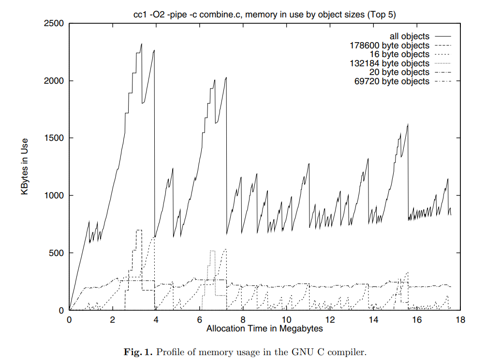
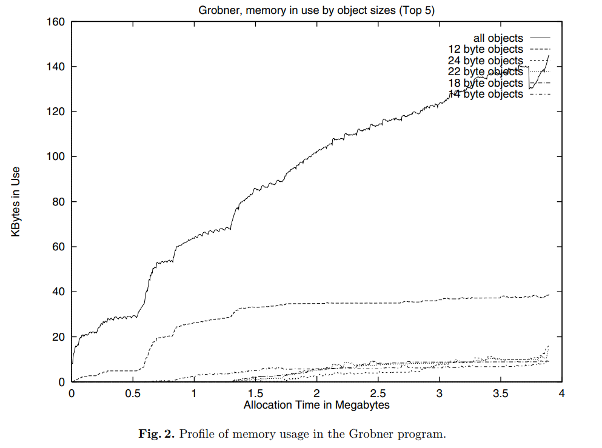
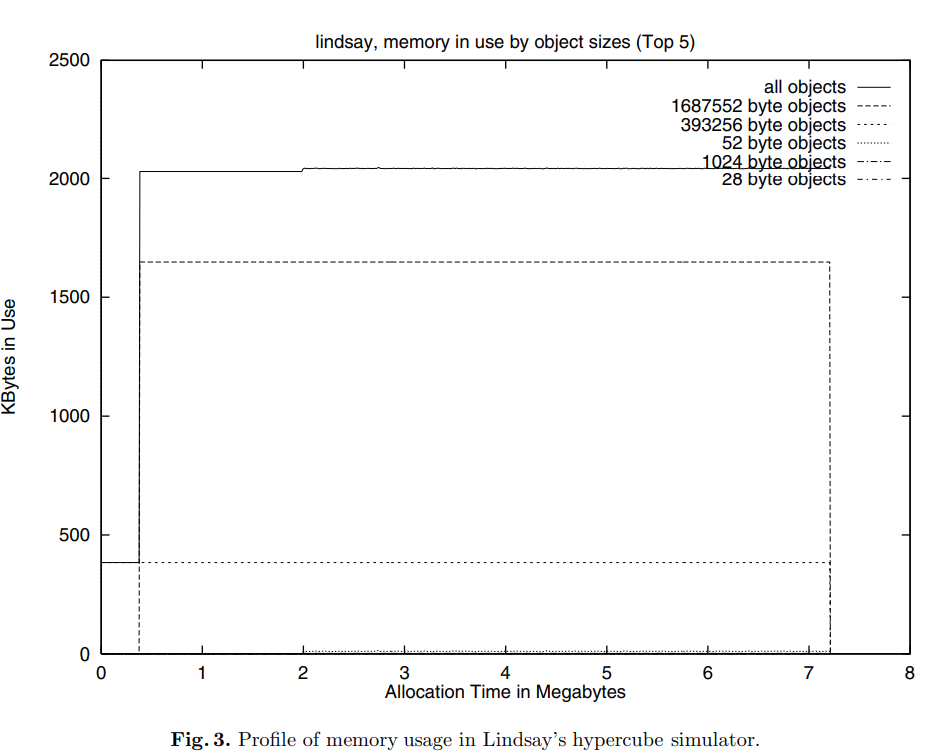

### Posługując się wykresem wykorzystania pamięci w trakcie życia procesu opowiedz o trzech wzorcach przydziału pamięci występujących w programach [6, §2.4].

#### - GCC:
- widać że program alokuje pamięc w "fazach", alokując duże i małe bloki w tym samym czasie

#### - Grobner (program do liczenia bazy wielomianów Grobnera):
- prgram równostajnie przydziela pamięć, ale nie zwalnia jej aż do końca

#### - Hypercube (symulator hiperkostki??):
- program alokuje dużo pamięci na początku, potem nic nie alokuje, a na końcu zwalnia całą pamięć

### Na podstawie paragrafu zatytułowanego „Exploiting ordering and size dependencies” wyjaśnij jaki jest związek między czasem życia bloku, a jego rozmiarem?
bloki o podobnych rozmiarach często są alokowane i zwalniane w podobnym czasie

### Wyjaśnij różnice między politykami znajdowania wolnych bloków: first-fit, next-fit i best-fit. Na podstawie [6, §3.4] wymień ich słabe i mocne strony.

- first-fit: alokuje pierwszy blok, który jest wystarczająco duży
    - mocne strony: szybki
    - słabe strony: może zostawić dużo małych bloków, które nie mogą być użyte

- next-fit: alokuje pierwszy blok, który jest wystarczająco duży, ale zaczyna od ostatniego bloku, który został sprawdzony
    - mocne strony: szybki
    - słabe strony: niska lokalność bloków, bloki tego samego "pochodzenia" mogą być rozrzucone po całej pamięci

- best-fit: alokuje najmniejszy blok, który jest wystarczająco duży
    - mocne strony: minimalizuje fragmentację wewnętrzną
    - słabe strony: wolny, bo musi przeszukać całą pamięć