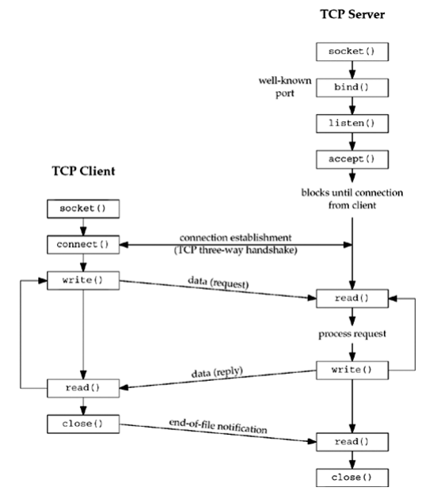

## Omów diagram [7, 4.1] komunikacji klient-serwer używającej protokołu tcp(7) przy pomocy interfejsu gniazd strumieniowych.

## W którym momencie następuje związanie gniazda z adresem lokalnym i zdalnym?
socket tworzy gniazdo związane z adresem lokalnym, a connect łączy z adresem zdalnym 

## Która ze stron komunikacji używa portów ulotnych (ang. ephemeral)?
*porty ulotne:* to tymczasowe porty używane przez klienta do komunikacji z serwerem. Po zakonczeniu komunikacji porty te są zwalniane i mogą być użyte przez innych.

## Co specyfikuje drugi argument wywołania systemowego listen(2)?
długość kolejki oczekujących połączeń

## Z jakim numerem portu jest związane gniazdo przekazywane do i zwracane z accept(2)?
przekazywane: gniazdo serwera
zwracane: gniazdo klienta

## Skąd serwer wie, że klient zakończył połączenie?
po tym że klient wysłał FIN/EOF