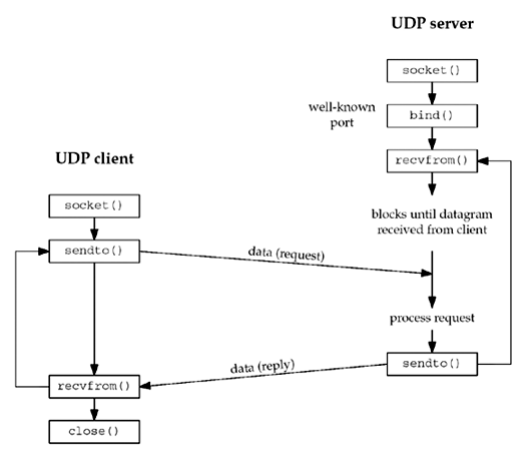

## Omów diagram [7, 8.1] komunikacji klient-serwer używającej protokołu udp(7) przy pomocy interfejsu gniazd datagramowych.



## Czemu, w przeciwieństwie do TCP, serwer może rozpocząć pracę zaraz po wykonaniu funkcji bind(2)?

Ponieważ UDP jest bezpołączeniowy, nie wymaga nawiązania połączenia z klientem

## Z jakiej przyczyny interfejs read(2) i write(2) po stronie serwera może być niewystarczający?

Ponieważ serwer musi wysyłać dane do konkretnego klienta, a read i write nie mają możliwości określenia adresu klienta

## Przedstaw semantykę operacji recvfrom(2) i sendto(2).

```C
ssize_t recvfrom(int sockfd, void *buf, size_t len, int flags, struct sockaddr *src_addr, socklen_t *addrlen);

ssize_t sendto(int sockfd, const void *buf, size_t len, int flags, const struct sockaddr *dest_addr, socklen_t addrlen);
```

## Kiedy po stronie klienta następuje związanie gniazda UDP z adresem lokalnym?

klient może użyć bind do związania gniazda, lecz gdy tego nie zrobi system sam przypisze mu adres podczas pierwszego sendto 

## Na podstawie [7, 8.11] zreferuj efekt jaki przynosi wykonanie connect(2) na gnieździe klienta.

```plaintext
man 2 connect:
If  the  socket sockfd is of type SOCK_DGRAM, then addr is the address to which datagrams are sent by default,
    and the only address from which datagrams are received.
```

użycie connect spowoduje że klient może używać funkcji read i write zamiast recvfrom i sendto

## Jakie ograniczenia poprzednio wymienionych funkcji zostały poprawione przez wywołania recvmsg(2) i sendmsg(2)?

recvmsg i sendmsg używają struktur msghdr i iovec, co pozwala na przesyłanie wielu wiadomości na raz, oraz na przesyłanie danych z wielu buforów

```C
struct iovec {                    /* Scatter/gather array items */
    void  *iov_base;              /* Starting address */
    size_t iov_len;               /* Number of bytes to transfer */
};

struct msghdr {
    void         *msg_name;       /* Optional address */
    socklen_t     msg_namelen;    /* Size of address */
    struct iovec *msg_iov;        /* Scatter/gather array */
    size_t        msg_iovlen;     /* # elements in msg_iov */
    void         *msg_control;    /* Ancillary data, see below */
    size_t        msg_controllen; /* Ancillary data buffer len */
    int           msg_flags;      /* Flags on received message */
};